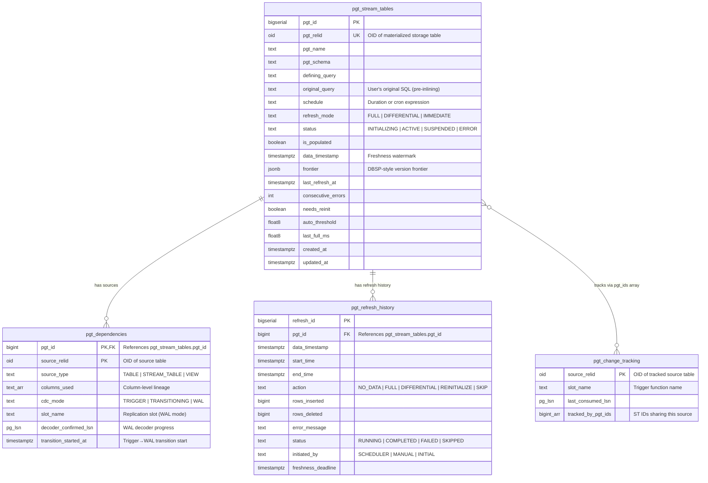

# Architecture

## v0.87 refresh transaction semantics

Large ordinary differential MERGE deltas are read through a detached SPI
cursor into bounded temporary batch relations. Each batch is applied inside
the caller's outer refresh transaction; frontier advancement, downstream CDC,
cleanup, history, and final status still finalize once at the end. Internal
savepoints bound error cleanup but do not provide progressive visibility or
early lock release.

This document describes the internal architecture of pg_trickle — a PostgreSQL 18 extension that implements stream tables with differential view maintenance.
For a high-level description of what pg_trickle does and why, read [ESSENCE.md](ESSENCE.md). For release milestones and future plans, see [Roadmap](roadmap.md).

---

## High-Level Overview

```
┌─────────────────────────────────────────────────────────────────┐
│                     PostgreSQL 18 Backend                       │
│                                                                 │
│  ┌──────────┐   ┌──────────┐   ┌──────────┐   ┌─────────────┐   │
│  │  Source  │   │  Source  │   │  Storage │   │  Storage    │   │
│  │  Table A │   │  Table B │   │  Table X │   │  Table Y    │   │
│  └────┬─────┘   └────┬─────┘   └────▲─────┘   └────▲────────┘   │
│       │              │              │              │            │
│  ═════╪══════════════╪══════════════╪══════════════╪════════    │
│       │              │              │              │            │
│  ┌────▼──────────────▼────┐   ┌────┴──────────────┴────┐        │
│  │  Hybrid CDC Layer      │   │  Delta Application     │        │
│  │  Triggers ──or── WAL   │   │  (INSERT/DELETE diffs) │        │
│  └────────────┬───────────┘   └────────────▲───────────┘        │
│               │                            │                    │
│  ┌────────────▼───────────┐   ┌────────────┴───────────┐        │
│  │   Change Buffer        │   │   DVM Engine           │        │
│  │   (pgtrickle_changes.*) │   │   (Operator Tree)      │        │
│  └────────────┬───────────┘   └────────────▲───────────┘        │
│               │                            │                    │
│               └────────────┬───────────────┘                    │
│                            │                                    │
│  ┌─────────────────────────▼─────────────────────────────┐      │
│  │              Refresh Engine                           │      │
│  │  ┌──────────┐  ┌──────────┐  ┌─────────────────────┐  │      │
│  │  │ Frontier │  │ DAG      │  │ Scheduler           │  │      │
│  │  │ Tracker  │  │ Resolver │  │ (canonical schedule)│  │      │
│  │  └──────────┘  └──────────┘  └─────────────────────┘  │      │
│  └───────────────────────────────────────────────────────┘      │
│                                                                 │
│  ┌────────────────────────────────────────────────────────┐     │
│  │                    Catalog (pgtrickle.*)                │     │
│  │  pgt_stream_tables │ pgt_dependencies │ pgt_refresh_history│  │
│  └────────────────────────────────────────────────────────┘     │
│                                                                 │
│  ┌──────────────────────────────────────────────────────┐       │
│  │                  Monitoring Layer                    │       │
│  │  st_refresh_stats │ slot_health │ check_cdc_health    │       │
│  │  explain_st │ views │ NOTIFY alerting               │       │
│  └──────────────────────────────────────────────────────┘       │
└─────────────────────────────────────────────────────────────────┘
```

---

## Component Details

### 1. SQL API Layer (`src/api/`)

The public entry point for users. All operations are exposed as `#[pg_extern]` functions in the `pgtrickle` schema. The API module is split into focused sub-modules:

| File | Responsibility |
|------|----------------|
| `src/api/mod.rs` | Core lifecycle: `create_stream_table`, `alter_stream_table`, `drop_stream_table`, `refresh_stream_table`, `bulk_create`, `repair_stream_table`, `pgt_status` |
| `src/api/diagnostics.rs` | Inspection helpers: `explain_st`, `explain_refresh_mode`, `dependency_tree`, `list_sources` |
| `src/api/outbox_hook.rs` | pg_tide integration hook: `attach_outbox()` — calls into pg_tide after each successful refresh |
| `src/api/snapshot.rs` | Stream table snapshots: `snapshot_stream_table`, `restore_from_snapshot`, `list_snapshots`, `drop_snapshot` |
| `src/api/self_monitoring.rs` | Self-monitoring setup/teardown and auto-apply policy |
| `src/api/cluster.rs` | Multi-database cluster overview: `cluster_worker_summary` |
| `src/api/publication.rs` | Logical publication helpers and predictive cost model utilities |
| `src/api/metrics_ext.rs` | Extended Prometheus metrics |
| `src/api/helpers.rs` | Shared utilities (name resolution, table quoting) |
| `src/api/planner.rs` | Schedule recommendation API |

**Core functions:**
- **create_stream_table** — Applies a chain of auto-rewrite passes (view inlining → DISTINCT ON → GROUPING SETS → scalar subquery in WHERE → correlated scalar subquery in SELECT → SubLinks in OR → multi-PARTITION BY windows), parses the defining query, builds an operator tree, creates the storage table, registers CDC slots, populates the catalog, and optionally performs an initial full refresh.
- **alter_stream_table** — Modifies schedule, refresh mode, status (ACTIVE/SUSPENDED), or defining query. Query changes trigger schema migration, dependency updates, and a full refresh within a single transaction.
- **drop_stream_table** — Removes the storage table, catalog entries, and cleans up CDC slots.
- **refresh_stream_table** — Triggers a manual refresh (same path as automatic scheduling).
- **pgt_status** — Returns a summary of all registered stream tables.

### 2. Catalog (`src/catalog.rs`)

The catalog manages persistent metadata stored in PostgreSQL tables within the `pgtrickle` schema:

| Table | Purpose |
|---|---|
| `pgtrickle.pgt_stream_tables` | Core metadata: name, query, schedule, status, frontier, etc. |
| `pgtrickle.pgt_dependencies` | DAG edges from ST to source tables |
| `pgtrickle.pgt_refresh_history` | Audit log of every refresh operation |
| `pgtrickle.pgt_change_tracking` | Per-source CDC slot metadata |

Schema creation is handled by `extension_sql!()` macros that run at `CREATE EXTENSION` time.

#### Entity-Relationship Diagram



> **Note:** Change buffer tables (`pgtrickle_changes.changes_<oid>`) are created dynamically per source table OID and live in the separate `pgtrickle_changes` schema.

### 3. CDC / Change Data Capture (`src/cdc.rs`, `src/wal_decoder.rs`)

pg_trickle uses a **hybrid CDC** architecture that starts with triggers and optionally transitions to WAL-based (logical replication) capture for lower write-side overhead.

#### Trigger Mode (initial path in `cdc_mode = 'auto'`)

1. **Trigger Management** — Creates statement-level `AFTER INSERT`, `AFTER UPDATE`, and `AFTER DELETE` triggers with transition tables on each tracked source table by default (`pg_trickle.cdc_trigger_mode = 'statement'`). Legacy row-level triggers are available with `pg_trickle.cdc_trigger_mode = 'row'`. Each trigger fires a PL/pgSQL function (`pg_trickle_cdc_fn_<stable_name>()`) that writes typed changes to the buffer table.
2. **Change Buffering** — Decoded changes are written to per-source change buffer tables in the `pgtrickle_changes` schema. Each row captures the LSN (`pg_current_wal_lsn()`), transaction ID, action type (I/D), the complete typed-V2 `__pgt_row_id BYTEA`, and flat typed user columns — native PostgreSQL types, not JSONB. UPDATEs are represented as D+I pairs.
3. **Cleanup** — Consumed changes are deleted after each successful refresh via `delete_consumed_changes()`, bounded by the upper LSN to prevent unbounded scans.
4. **Lifecycle** — Triggers and trigger functions are automatically created when a source table is first tracked and dropped when the last stream table referencing a source is removed.

The trigger approach is the initial path in `cdc_mode = 'auto'` because it gives **transaction safety** (triggers can be created in the same transaction as DDL), **simplicity** (no slot management, no `wal_level = logical` requirement), and **immediate visibility** (changes are visible in buffer tables as soon as the source transaction commits).

#### WAL Mode (optional, automatic transition)

When `pg_trickle.cdc_mode` is set to `'auto'` or `'wal'` and `wal_level = logical` is available, the system transitions from trigger-based to WAL-based CDC after the first successful refresh:

1. **WAL Availability Detection** — At stream table creation, checks whether `wal_level = logical` is configured. If so, the source dependency is marked for WAL transition.
2. **WAL Decoder Background Worker** — A dedicated background worker (`src/wal_decoder.rs`) polls logical replication slots and writes decoded changes into the same change buffer tables used by triggers, ensuring a uniform format for the DVM engine.
3. **Transition Orchestration** — The transition is a three-step process: (a) create a replication slot, (b) wait for the decoder to catch up to the trigger's last confirmed LSN, (c) drop the trigger and switch the dependency to WAL mode. If the decoder doesn't catch up within `pg_trickle.wal_transition_timeout` (default 300s), the system falls back to triggers.
4. **CDC Mode Tracking** — Each source dependency in `pgt_dependencies` carries a `cdc_mode` column (TRIGGER / TRANSITIONING / WAL) and WAL-specific metadata (`slot_name`, `decoder_confirmed_lsn`, `transition_started_at`).

See ADR-001 and ADR-002 in [plans/adrs/PLAN_ADRS.md](https://github.com/trickle-labs/pg-trickle/blob/main/plans/adrs/PLAN_ADRS.md) for the original design rationale and [plans/sql/PLAN_HYBRID_CDC.md](https://github.com/trickle-labs/pg-trickle/blob/main/plans/sql/PLAN_HYBRID_CDC.md) for the full implementation plan.

#### Immediate Mode / Transactional IVM (`src/ivm.rs`)

When `refresh_mode = 'IMMEDIATE'`, pg_trickle uses **statement-level AFTER triggers with transition tables** instead of row-level CDC triggers. The stream table is maintained **synchronously within the same transaction** as the base table DML.

1. **BEFORE Triggers** — Statement-level BEFORE triggers on each base table acquire an advisory lock on the stream table to prevent concurrent conflicting updates.
2. **AFTER Triggers** — Statement-level AFTER triggers with `REFERENCING NEW TABLE AS ... OLD TABLE AS ...` copy the transition table data to temp tables, then call the Rust `pgt_ivm_apply_delta()` function.
3. **Delta Computation** — The DVM engine's `Scan` operator reads from the temp tables (via `DeltaSource::TransitionTable`) instead of change buffer tables. No LSN filtering or net-effect computation is needed — each trigger invocation represents a single atomic statement.
4. **Delta Application** — The computed delta is applied via explicit DML (DELETE + INSERT ON CONFLICT) to the stream table.
5. **TRUNCATE** — A separate AFTER TRUNCATE trigger calls `pgt_ivm_handle_truncate()`, which truncates the stream table and re-populates from the defining query.

No change buffer tables, no scheduler involvement, and no WAL infrastructure is needed for IMMEDIATE mode. See [plans/sql/PLAN_TRANSACTIONAL_IVM.md](https://github.com/trickle-labs/pg-trickle/blob/main/plans/sql/PLAN_TRANSACTIONAL_IVM.md) for the design plan.

#### ST-to-ST Change Capture

When a stream table's defining query references another stream table (rather than a base table), neither triggers nor WAL capture apply — the upstream source is itself maintained by pg_trickle. A dedicated **ST change buffer** mechanism enables downstream stream tables to refresh differentially even when their source is another stream table.

```
  Base Table  ──trigger/WAL──▶  changes_<oid>       (base-table buffer)
  Stream Table A  ──refresh──▶  changes_pgt_<pgt_id>  (ST buffer for A's consumers)
  Stream Table B  reads from    changes_pgt_<pgt_id>  (B depends on A)
```

**Buffer schema.** ST change buffers are named `pgtrickle_changes.changes_pgt_<pgt_id>` (using the internal `pgt_id` rather than the OID). They use the same flat D+I schema as base-table buffers: complete `__pgt_row_id BYTEA` plus typed user columns. UPDATEs are represented as INSERT/DELETE pairs, so there are no `new_*`/`old_*` column pairs.

**Delta capture — DIFFERENTIAL path.** When an upstream stream table refreshes in DIFFERENTIAL mode and has downstream consumers, the refresh engine captures the computed delta (the INSERT and DELETE rows applied to the upstream ST) into the ST change buffer via explicit DML. Downstream stream tables then read from this buffer exactly as they would read from a base-table change buffer.

**Delta capture — FULL path.** When an upstream stream table refreshes in FULL mode (e.g., due to a mode downgrade or `full => true`), the engine takes a **pre-refresh snapshot**, executes the full refresh, then computes an `EXCEPT ALL` diff between the old and new contents. The resulting INSERT/DELETE pairs are written to the ST change buffer. This prevents FULL refreshes from cascading through the entire dependency chain — downstream STs always receive a minimal delta regardless of how the upstream was refreshed.

**Frontier tracking.** ST source positions are tracked in the same frontier JSONB structure as base-table sources, using `pgt_<upstream_pgt_id>` as the key (e.g., `{"pgt_42": 157}`) rather than the OID-based keys used for base tables. The scheduler's `has_stream_table_source_changes()` function compares the downstream's last-consumed frontier position against the upstream buffer's current maximum LSN to decide whether a refresh is needed.

**Lifecycle.** ST change buffers are created automatically when a stream table gains its first downstream consumer (`create_st_change_buffer_table()`), and dropped when the last downstream consumer is removed (`drop_st_change_buffer_table()`). Existing ST-to-ST dependencies have their buffers auto-created on the first scheduler tick. Consumed rows are cleaned up by `cleanup_st_change_buffers_by_frontier()` after each successful downstream refresh.

#### Frontier Visibility Holdback (Issue #536)

The CDC frontier (`pgt_stream_tables.frontier`) is advanced based on **LSN ordering** while the change buffer is read under standard **MVCC visibility**. These two dimensions are orthogonal: a change buffer row may have an LSN below the new frontier yet still be invisible (uncommitted) at the moment the scheduler queries the buffer.

**Failure scenario (trigger-based CDC only):**
Without holdback, a transaction that inserts into a tracked table and commits *after* the scheduler has captured the tick watermark (`pg_current_wal_lsn()`) will have its change-buffer row permanently skipped on the next tick, because the frontier advanced past the row's LSN while the row was still uncommitted.

**Fix — one mandatory safe-frontier probe:**
Before computing the tick watermark, the scheduler captures a materialized WAL
candidate and probes `backend_xid`, `backend_xmin`, and prepared transactions.
Writer fences hold the frontier until every potentially invisible buffer write
has a proven bound. Permission or malformed-result failures hold dispatch
closed; no holdback mode can bypass this proof.

The holdback algorithm (`cdc::classify_holdback`) is purely functional and unit-tested independently of the backend.

**Configuration:**
- `pg_trickle.frontier_holdback_mode` — `'xmin'` (default), `'none'` (no additional margin), `'lsn:<N>'` (an additional cap). All modes retain the mandatory probe.
- `pg_trickle.frontier_holdback_warn_seconds` — emit a `WARNING` (at most once per minute) when holdback has been active longer than this many seconds (default: 60).

WAL/logical-replication sources additionally use their durably decoded buffer
position; raw current WAL is never recorded as a source frontier.

**Observability:** Two Prometheus gauges are exposed:
- `pg_trickle_frontier_holdback_lsn_bytes` — how many WAL bytes behind write_lsn the safe frontier currently is.
- `pg_trickle_frontier_holdback_seconds` — age (in seconds) of the oldest in-progress transaction.

See `plans/safety/PLAN_FRONTIER_VISIBILITY_HOLDBACK.md` for the full design rationale.

### 4. DVM Engine (`src/dvm/`)

The Differential View Maintenance engine is the core of the system. It transforms the defining SQL query into an executable operator tree that can compute deltas efficiently.

#### Auto-Rewrite Pipeline (`src/dvm/parser.rs`)

Before the defining query is parsed into an operator tree, it passes through a chain of auto-rewrite passes that normalize SQL constructs the DVM parser doesn't handle directly:

| Pass | Function | Purpose |
|------|----------|---------|
| #0 | `rewrite_views_inline()` | Replace view references with `(view_definition) AS alias` subqueries |
| #1 | `rewrite_distinct_on()` | Convert `DISTINCT ON` to `ROW_NUMBER() OVER (…) = 1` window subquery |
| #2 | `rewrite_grouping_sets()` | Decompose `GROUPING SETS` / `CUBE` / `ROLLUP` into `UNION ALL` of `GROUP BY` |
| #3 | `rewrite_scalar_subquery_in_where()` | Convert `WHERE col > (SELECT …)` to `CROSS JOIN` |
| #4 | `rewrite_sublinks_in_or()` | Split `WHERE a OR EXISTS (…)` into `UNION` branches |
| #5 | `rewrite_multi_partition_windows()` | Split multiple `PARTITION BY` clauses into joined subqueries |

The view inlining pass (#0) runs first so that view definitions containing DISTINCT ON, GROUPING SETS, etc. are further rewritten by downstream passes. Nested views are expanded via a fixpoint loop (max depth 10).

#### Query Parser (`src/dvm/parser.rs`)

Parses the defining query using PostgreSQL's internal parser (via pgrx `raw_parser`) and extracts:
- **WITH clause** — CTE definitions (non-recursive: inline expansion or shared delta; recursive: detected for mode gating)
- **Target list** — output columns
- **FROM clause** — source tables, joins, subqueries, and CTE references
- **WHERE clause** — filters
- **GROUP BY / aggregate functions**
- **DISTINCT / UNION ALL / INTERSECT / EXCEPT**

The parser produces an `OpTree` — a tree of operator nodes. CTE handling follows a tiered approach:

1. **Tier 1 (Inline Expansion)** — Non-recursive CTEs referenced once are expanded into `Subquery` nodes, equivalent to subqueries in FROM.
2. **Tier 2 (Shared Delta)** — Non-recursive CTEs referenced multiple times produce `CteScan` nodes that share a single delta computation via a CTE registry and delta cache.
3. **Tier 3a/3b/3c (Recursive)** — Recursive CTEs (`WITH RECURSIVE`) are detected via `query_has_recursive_cte()`. In FULL mode, the query executes as-is. In DIFFERENTIAL mode, the strategy is auto-selected: semi-naive evaluation for INSERT-only changes, Delete-and-Rederive (DRed) for mixed changes, or recomputation fallback when CTE columns don't match ST storage or when the recursive term contains non-monotone operators (EXCEPT, Aggregate, Window, DISTINCT, AntiJoin, INTERSECT SET). In IMMEDIATE mode, the same semi-naive / DRed machinery runs against statement transition tables and is bounded by `pg_trickle.ivm_recursive_max_depth` to guard against unbounded recursion.

#### Delta execution contexts and planning

`DiffContext` remains the value passed through differentiation. It delegates
frontiers and CDC metadata to `CdcContext`, reusable query state to
`CacheContext`, and CTE emission and limits to `OptimizationContext`.

The v0.88 planner collects one owned statistics snapshot in a short SPI block.
It records current-plan estimates, observations, semantic barriers, and shadow
candidates. PostgreSQL still chooses physical join algorithms and build sides.
An unvalidated rewrite stays in shadow mode and does not change generated SQL.

For an eligible top-level aggregate over one scan, the vector producer copies
at most 1,024 change rows into concrete owned columns and reduces them with
checked Rust loops. Page results combine in a memory-budgeted hash table; when
that table reaches its budget, it spills consolidated groups to a PostgreSQL
temporary relation. Its output uses the same delta relation and apply path as
the SQL producer. Unsupported functions, types, collations, and target layouts
keep the SQL path.

#### § Recursive CTE Strategy Selection

The DVM engine selects among five strategies for `WITH RECURSIVE` queries. The
selection is logged at startup and visible via `explain_stream_table()`.

| Tier | Condition | Strategy |
|------|-----------|----------|
| **Tier 1** | CTE is non-recursive and referenced once | Inline expansion — CTE is expanded inline; no differential overhead. |
| **Tier 2** | CTE is non-recursive and referenced 2+ times | Shared delta — single delta computation reused across all reference sites. |
| **Tier 3a** | CTE is recursive with monotone operators only (UNION ALL, no NOT EXISTS / aggregation) | Semi-naive evaluation — frontier-bounded delta avoids full recomputation. |
| **Tier 3b** | CTE is recursive with non-monotone operators; base tables have primary keys | DRed (Deletion Propagation in Recursive Datalog) — handles deletions by re-deriving affected tuples. |
| **Tier 3c** | CTE is recursive with non-monotone operators and no primary keys, or cycle in dependency graph | Full recomputation — most conservative; correct for all inputs. |

**Observability**: `explain_stream_table(st_name)` returns a `recursive_cte_strategy`
field showing which tier was selected and the reason. Example output:

```json
{
  "recursive_cte_strategy": "semi_naive",
  "recursive_cte_reason": "Tier 3a: monotone UNION ALL recursion with no aggregation or NOT EXISTS"
}
```

**Example — Tier 3a (semi-naive) for hierarchical closure:**

```sql
WITH RECURSIVE ancestors AS (
  SELECT id, parent_id FROM org_chart WHERE parent_id IS NULL
  UNION ALL
  SELECT c.id, c.parent_id
  FROM org_chart c
  JOIN ancestors a ON c.parent_id = a.id
)
SELECT * FROM ancestors;
```

Because the recursive term uses only `UNION ALL` and a plain `JOIN` (both
monotone), pg_trickle selects **Tier 3a (semi-naive)**: only newly reachable
rows are computed per delta, not the full transitive closure.

#### Operators (`src/dvm/operators/`)

Each operator knows how to generate a **delta query** — given a set of changes to its inputs, it produces the corresponding changes to its output:

| Operator | Delta Strategy |
|---|---|
| **Scan** | Direct passthrough of CDC changes |
| **Filter** | Apply WHERE predicate to deltas |
| **Project** | Apply column projection to deltas |
| **Join** | Join deltas against the other side's current state |
| **OuterJoin** | LEFT/RIGHT outer join with NULL padding |
| **FullJoin** | FULL OUTER JOIN with 8-part delta (both sides may produce NULLs) |
| **Aggregate** | Recompute group values where affected keys changed |
| **Distinct** | COUNT-based duplicate tracking |
| **UnionAll** | Merge deltas from both branches |
| **Intersect** | Dual-count multiplicity with LEAST boundary crossing |
| **Except** | Dual-count multiplicity with GREATEST(0, L-R) boundary crossing |
| **Subquery** | Transparent delegation + optional column renaming (CTEs, subselects) |
| **CteScan** | Shared delta lookup from CTE cache (multi-reference CTEs) |
| **RecursiveCte** | Semi-naive / DRed / recomputation for `WITH RECURSIVE` |
| **Window** | Partition-based recomputation for window functions |
| **LateralFunction** | Row-scoped recomputation for SRFs in FROM (jsonb_array_elements, unnest, etc.) |
| **LateralSubquery** | Row-scoped recomputation for correlated subqueries in LATERAL FROM |
| **SemiJoin** | EXISTS / IN subquery delta via semi-join |
| **AntiJoin** | NOT EXISTS / NOT IN subquery delta via anti-join |
| **ScalarSubquery** | Correlated scalar subquery in SELECT list |

See [DVM_OPERATORS.md](DVM_OPERATORS.md) for detailed descriptions.

#### Diff Engine (`src/dvm/diff.rs`)

Generates the final diff SQL that:
1. Computes the delta from the operator tree
2. Produces `('+', row)` for inserts and `('-', row)` for deletes
3. Applies the diff via `DELETE` matching old rows and `INSERT` for new rows

### 5. DAG / Dependency Graph (`src/dag.rs`)

Stream tables can depend on other stream tables (cascading), forming a Directed Acyclic Graph:

- **Cycle detection** — Detects circular dependencies at creation time using Kahn's algorithm (BFS topological sort). When `pg_trickle.allow_circular = true`, monotone cycles (queries using only safe operators — joins, filters, UNION ALL, etc.) are allowed; non-monotone cycles (aggregates, EXCEPT, window functions, anti-joins) are rejected. SCC IDs are automatically assigned to cycle members and recomputed on drop/alter.
- **SCC decomposition** — Tarjan's algorithm decomposes the graph into strongly connected components. Singleton SCCs are acyclic; multi-node SCCs contain cycles that are handled by fixed-point iteration in the scheduler.
- **Monotonicity analysis** — Static check (`check_monotonicity()` in `src/dvm/parser.rs`) determines whether a query's operators are safe for cyclic fixed-point iteration. Non-monotone operators (Aggregate, EXCEPT, Window, NOT EXISTS) block cycle creation.
- **Topological ordering** — Determines refresh order: upstream STs must be refreshed before downstream STs.
- **Condensation order** — `condensation_order()` returns SCCs in topological order, grouping cyclic STs for fixed-point iteration. The scheduler's `iterate_to_fixpoint()` processes multi-node SCCs by refreshing all members repeatedly until convergence (zero net changes) or `max_fixpoint_iterations` is exceeded.
- **Cascade operations** — When a source table changes, all transitive dependents are identified for refresh.

### 6. Version / Frontier Tracking (`src/version.rs`)

Implements a per-source **frontier** (JSONB map of `source_oid → LSN`) to track exactly how far each stream table has consumed changes:

- **Read frontier** — Before refresh, read the frontier to know where to start consuming changes.
- **Advance frontier** — After a successful refresh, the frontier is updated to the latest consumed LSN.
- **Consistent snapshots** — The frontier ensures that each refresh processes a contiguous, non-overlapping window of changes.

#### Delayed View Semantics (DVS) Guarantee

The contents of every stream table are logically equivalent to evaluating its defining query at some past point in time — the `data_timestamp`. The scheduler refreshes STs in **topological order** so that when ST B references upstream ST A, A has already been refreshed to the target `data_timestamp` before B runs its delta query against A's contents. The frontier lifecycle is:

1. **Created** — on first full refresh; records the LSN of each source at that moment.
2. **Advanced** — on each differential refresh; the old frontier becomes the lower bound and the new frontier (with fresh LSNs) the upper bound. The DVM engine reads changes in `[old, new]`.
3. **Reset** — on reinitialize; a fresh frontier is created from scratch.

### 7. Refresh Engine (`src/refresh.rs`)

Orchestrates the complete refresh cycle:

```
┌──────────────┐
│  Check State │ → Is ST active? Has it been populated?
└──────┬───────┘
       │
 ┌─────▼──────┐
 │ Drain CDC  │ → Read WAL changes into change buffer tables
 └─────┬──────┘
       │
 ┌─────▼──────────────┐
 │ Determine Action   │ → FULL, DIFFERENTIAL, NO_DATA, REINITIALIZE, or SKIP?
 │                    │   (adaptive: if change ratio > pg_trickle.differential_max_change_ratio,
 │                    │    downgrade DIFFERENTIAL → FULL automatically)
 └─────┬──────────────┘
       │
 ┌─────▼──────┐
 │ Execute    │ → Full: TRUNCATE + INSERT ... SELECT
 │            │   Differential: Generate & apply delta SQL
 └─────┬──────┘
       │
 ┌─────▼──────────────┐
 │ Record History     │ → Write to pgtrickle.pgt_refresh_history
 └─────┬──────────────┘
       │
 ┌─────▼──────────────┐
 │ Advance Frontier   │ → Update JSONB frontier in catalog
 └─────┬──────────────┘
       │
 ┌─────▼──────────────┐
 │ Reset Error Count  │ → On success, reset consecutive_errors to 0
 └──────────────────────┘
```

### 8. Background Worker & Scheduling (`src/scheduler/`)

#### Registration & Lifecycle

pg_trickle registers one static PostgreSQL background worker — the
**launcher** — during `_PG_init()` (extension load). The launcher discovers
databases that have pg_trickle installed and starts one dynamic scheduler
worker per database. Because the launcher, shared memory, and GUCs are
registered at startup, `pg_trickle` **must** appear in
`shared_preload_libraries`, which requires a server restart.

```
┌──────────────────────────────────────────────────────────────────┐
│                  PostgreSQL postmaster                           │
│                                                                  │
│  shared_preload_libraries = 'pg_trickle'                          │
│       │                                                          │
│       ▼                                                          │
│  _PG_init()                                                      │
│    ├─ Register GUCs (pg_trickle.enabled, scheduler_interval_ms …) │
│    ├─ Register shared memory (PgTrickleSharedState, atomics)      │
│    └─ BackgroundWorkerBuilder::new("pg_trickle launcher")         │
│         .set_start_time(RecoveryFinished)                        │
│         .set_restart_time(5s)       ← auto-restart on crash      │
│         .load()                                                  │
│                                                                  │
│  After recovery finishes:                                        │
│       │                                                          │
│       ▼                                                          │
│  pg_trickle_launcher_main()          ← launcher worker starts     │
│    ├─ Attach SIGHUP + SIGTERM handlers                           │
│    ├─ Connect to SPI (database = "postgres")                     │
│    ├─ Scan pg_database for pg_trickle installs                    │
│    ├─ Spawn missing per-database schedulers                       │
│    └─ Enter discovery loop ───────────────────┐                  │
│         │                                      │                 │
│         ▼                                      │                 │
│     wait_latch(scheduler_interval_ms)          │                 │
│         │                                      │                 │
│     ┌───▼───────────────────────────────┐      │                 │
│     │ SIGTERM? → log + break            │      │                 │
│     │ pg_trickle.enabled = false? → skip │      │                 │
│     │ Otherwise → discovery tick        │      │                 │
│     └───┬───────────────────────────────┘      │                 │
│         │                                      │                 │
│         └──────────── loop ────────────────────┘                 │
└──────────────────────────────────────────────────────────────────┘
```

Each per-database scheduler then connects to its target database, marks stale
`RUNNING` refresh records as `FAILED`, and runs the normal scheduler tick loop
for that database. The launcher automatically re-spawns schedulers that crash
or exit, and databases without pg_trickle installed are skipped until the next
discovery interval.

Key lifecycle properties:

| Property | Behaviour |
|---|---|
| **Start condition** | After PostgreSQL recovery finishes (`RecoveryFinished`) |
| **Auto-restart** | 5-second delay after an unexpected crash |
| **Graceful shutdown** | Launcher and schedulers handle `SIGTERM` — they break the loop and exit cleanly |
| **Config reload** | Launcher and schedulers handle `SIGHUP` — they re-read GUC values on the next latch wake |
| **Crash recovery** | Per-database schedulers mark any `pgt_refresh_history` rows stuck in `RUNNING` status as `FAILED` on startup |
| **Database connections** | Launcher connects to `postgres`; each scheduler connects to its own database via SPI |
| **Standby / replica** | On standby servers (`pg_is_in_recovery() = true`), the launcher sleeps and does **not** spawn refresh workers. Stream tables are still readable on standbys — they are regular heap tables replicated via physical streaming replication. After promotion the launcher resumes automatically. See the [FAQ § Replication](FAQ.md#ec-21-22-23) for details on logical replication and subscriber limitations. |

#### Scheduler Tick

Each tick of the main loop performs the following steps inside a single transaction:

1. **DAG rebuild** — Compare the shared-memory `DAG_REBUILD_SIGNAL` counter against the local copy. If it advanced (a `CREATE`, `ALTER`, or `DROP` stream table occurred), rebuild the in-memory dependency graph (`StDag`) from the catalog.
2. **Topological traversal** — Walk stream tables in dependency order (upstream before downstream). This ensures that when ST B references ST A, A is refreshed first.
3. **Per-ST evaluation** — For each active ST:
   - Skip if in retry backoff (exponential, per-ST).
   - Skip if schedule/cron says not yet due.
   - Skip if a row-level lock on the catalog entry indicates a concurrent refresh.
   - Check upstream change buffers for pending rows.
4. **Execute refresh** — Acquire a row-level lock on the catalog entry → record `RUNNING` in history → run `FULL` / `DIFFERENTIAL` / `REINITIALIZE` → store new frontier → release lock → record completion.
5. **WAL transitions** — Advance any trigger→WAL CDC mode transitions (`src/wal_decoder.rs`).
6. **Slot health** — Check replication slot health and emit `NOTIFY` alerts.
7. **Prune retry state** — Remove backoff entries for STs that no longer exist.

#### Sequential Processing (`parallel_refresh_mode = 'off'`)

When `parallel_refresh_mode = 'off'`, each per-database scheduler processes
stream tables sequentially. All STs in that database are refreshed one at a
time in topological order. Parallel refresh is the default in current releases;
sequential mode is an explicit resource-constrained or diagnostic setting.
`pg_trickle.max_concurrent_refreshes` (default 4) only prevents a manual
`pgtrickle.refresh_stream_table()` call from overlapping with the
scheduler on the *same* ST — it does not spawn additional workers.

The PostgreSQL GUC `max_worker_processes` (default 8) sets the server-wide
budget for *all* background workers (autovacuum, parallel query, logical
replication, extensions). In sequential mode pg_trickle consumes one launcher
slot plus one scheduler slot per database with pg_trickle installed.

#### Parallel Refresh (`parallel_refresh_mode = 'on'`)

When enabled, the scheduler builds an **execution-unit DAG** from the
stream-table dependency graph and dispatches independent units to
dynamic background workers:

1. **Execution units** — Each independent stream table becomes a
   *singleton* unit. Atomic consistency groups and IMMEDIATE-trigger
   closures are collapsed into composite units that run in a single
   worker for correctness.
2. **Ready queue** — Units whose upstream dependencies have all
   completed enter the ready queue. The coordinator dispatches them
   subject to a per-database cap (`max_concurrent_refreshes`) and a
   cluster-wide cap (`max_dynamic_refresh_workers`).
3. **Dynamic workers** — Each dispatched unit spawns a short-lived
   background worker via `BackgroundWorkerBuilder::load_dynamic()`.
   Workers claim a job from the `pgtrickle.pgt_scheduler_jobs` catalog
   table, execute the refresh, and exit.

The parallel path respects the same topological ordering as the
sequential path — downstream units only become ready after all upstream
units succeed. The worker-budget caps ensure pg_trickle does not exhaust
`max_worker_processes`.

See [PLAN_PARALLELISM.md](https://github.com/trickle-labs/pg-trickle/blob/main/plans/sql/PLAN_PARALLELISM.md) for the full
design and [CONFIGURATION.md](CONFIGURATION.md#parallel-refresh) for
tuning guidance.

#### Retry & Error Handling

Each ST maintains an in-memory `RetryState` (reset on scheduler restart):

- **Retryable errors** (SPI failures, lock contention, slot issues) trigger exponential backoff.
- **Permanent errors** (schema mismatch, user errors) skip backoff but increment `consecutive_errors`.
- When `consecutive_errors` reaches `pg_trickle.max_consecutive_errors` (default 3), the ST is auto-suspended and a `NOTIFY` alert is emitted.
- Schema errors additionally set `needs_reinit`, triggering a `REINITIALIZE` on the next successful cycle.

#### Scheduling Policy

Automatic refresh scheduling uses **canonical periods** (48·2ⁿ seconds, n = 0, 1, 2, …) snapped to the user's `schedule`:

- Picks the smallest canonical period ≤ `schedule`.
- For **DOWNSTREAM** schedule (NULL schedule), the ST refreshes only when explicitly triggered or when a downstream ST needs it.
- Advisory locks prevent concurrent refreshes of the same ST.
- The scheduler is driven by the background worker polling at the `pg_trickle.scheduler_interval_ms` GUC interval.

#### Shared Memory (`src/shmem.rs`)

The scheduler background worker and user sessions share a `PgTrickleSharedState` structure protected by a `PgLwLock`. Key fields:

| Field | Type | Purpose |
|---|---|---|
| `dag_version` | `u64` | Incremented when the ST catalog changes; used by the scheduler to detect when the DAG needs rebuilding. |
| `scheduler_pid` | `i32` | PID of the scheduler background worker (0 if not running). |
| `scheduler_running` | `bool` | Whether the scheduler is active. |
| `last_scheduler_wake` | `i64` | Unix timestamp of the last scheduler wake cycle (for monitoring). |

A separate `PgAtomic<AtomicU64>` named `DAG_REBUILD_SIGNAL` is incremented by API functions (`create`, `alter`, `drop`) after catalog mutations. The scheduler compares its local copy against the atomic counter to detect when to rebuild its in-memory DAG without holding a lock.

A second `PgAtomic<AtomicU64>` named `CACHE_GENERATION` tracks DDL events that may invalidate cached delta or MERGE templates across backends. When DDL hooks fire (view change, ALTER TABLE, function change) or API functions mutate the catalog, `CACHE_GENERATION` is bumped. Each backend maintains a thread-local generation counter; on the next refresh, if the shared generation has advanced, the backend flushes its delta template cache, MERGE template cache, and explicitly `DEALLOCATE`s tracked `__pgt_merge_*` prepared statements before rebuilding local state.

### 9. DDL Tracking (`src/hooks.rs`)

Event triggers monitor DDL changes to source tables and functions:

- **`_on_ddl_end`** — Fires on `ALTER TABLE` to detect column adds/drops/type changes. If a source table used by a ST is altered, the ST's `needs_reinit` flag is set. Also detects `CREATE OR REPLACE FUNCTION` / `ALTER FUNCTION` — if the function appears in a ST's `functions_used` catalog column, the ST is marked for reinit.
- **`_on_sql_drop`** — Fires on `DROP TABLE` to set `needs_reinit` for affected STs. Also detects `DROP FUNCTION` and marks affected STs for reinit.
- **Function name extraction** — `object_identity` strings (e.g., `public.my_func(integer, text)`) are parsed to extract the bare function name, which is matched against the `functions_used TEXT[]` column in `pgt_stream_tables`.

Reinitialization is deferred until the next refresh cycle, which then performs a `REINITIALIZE` action (drop and recreate the storage table from the updated query).

### 10. Error Handling (`src/error.rs`)

Centralized error types using `thiserror`:

- `PgTrickleError` variants cover catalog access, SQL execution, CDC, DVM, DAG, and config errors.
- Each refresh failure increments `consecutive_errors`.
- When `consecutive_errors` reaches `pg_trickle.max_consecutive_errors` (default 3), the ST is moved to `ERROR` status and suspended from automatic refresh.
- Manual intervention (`ALTER ... status => 'ACTIVE'`) resets the counter.

### 11. Monitoring (`src/monitor.rs`)

Provides observability functions:

- **st_refresh_stats** — Aggregate statistics (total/successful/failed refreshes, avg duration, staleness status).
- **get_refresh_history** — Per-ST audit trail.
- **get_staleness** — Current staleness in seconds.
- **slot_health** — Checks replication slot state and WAL retention.
- **check_cdc_health** — Per-source CDC health status including mode, slot lag, confirmed LSN, and alerts.
- **explain_st** — Describes the DVM plan for a given ST.
- **diamond_groups** — Lists detected diamond dependency groups, their members, convergence points, and epoch counters.
- **Views** — `pgtrickle.stream_tables_info` (computed staleness) and `pgtrickle.pg_stat_stream_tables` (combined stats).

#### NOTIFY Alerting

Operational events are broadcast via PostgreSQL `NOTIFY` on the `pg_trickle_alert` channel. Clients can subscribe with `LISTEN pg_trickle_alert;` and receive JSON-formatted events:

| Event | Condition |
|---|---|
| `stale` | data staleness exceeds 2× `schedule` |
| `auto_suspended` | ST suspended after `pg_trickle.max_consecutive_errors` failures |
| `reinitialize_needed` | Upstream DDL change detected |
| `slot_lag_warning` | Replication slot WAL retention exceeded `pg_trickle.slot_lag_warning_threshold_mb` |
| `cdc_transition_complete` | Source transitioned from trigger to WAL-based CDC |
| `cdc_transition_failed` | Trigger→WAL transition failed (fell back to triggers) |
| `refresh_completed` | Refresh completed successfully |
| `refresh_failed` | Refresh failed with an error |

### 12. Row Identity (`src/dvm/row_id_v2.rs`)

Provides deterministic, typed, versioned row identities as canonical `BYTEA` values. The legacy hash helpers remain available as compatibility utilities, but are not used as persisted stream-table identities.

- **`pgtrickle.pg_trickle_hash(text)`** — Legacy 64-bit compatibility utility.
- **`pgtrickle.pg_trickle_hash_multi(text[])`** — Legacy text-array compatibility utility.

Row IDs are written into every stream table's storage as an internal `__pgt_row_id BYTEA NOT NULL` column and are used by the delta application phase to match `DELETE` candidates precisely. A bounded direct index or non-unique `row_probe_v1` expression index accelerates lookup; complete identity equality is the correctness check.
The `pgt_stream_tables.row_identity_version` and
`pgt_change_buffers.row_identity_version` catalog fields record the framing
version. Unknown or legacy values fail closed for incremental maintenance;
the probe is only an accelerator, not a substitute for complete identity equality.

### 13. Diamond Dependency Consistency (`src/dag.rs`)

When stream tables form **diamond-shaped dependency graphs**, a convergence (fan-in) node may read from multiple upstream STs that share a common ancestor:

```
        A (source table)
       / \
      B   C   (intermediate STs)
       \ /
        D     (convergence / fan-in ST)
```

If B refreshes successfully but C fails, D would read a fresh version of B's data alongside stale data from C — a **split-version inconsistency**.

#### Detection

`StDag::detect_diamonds()` walks all fan-in nodes (STs with multiple upstream ST dependencies) and computes transitive ancestor sets per branch. If two or more branches share ancestors, a diamond is detected. Overlapping diamonds are merged.

#### Consistency Groups

`StDag::compute_consistency_groups()` converts detected diamonds into **consistency groups** — topologically ordered sets of STs that must be refreshed atomically. Each group contains:

- **Members** — All intermediate STs plus the convergence node, in refresh order.
- **Convergence points** — The fan-in nodes where multiple paths meet.
- **Epoch counter** — Advances on each successful atomic refresh.

STs not involved in any diamond are placed in singleton groups (no overhead).

#### Scheduler Wiring

When `diamond_consistency = 'atomic'` (per-ST or via the `pg_trickle.diamond_consistency` GUC):

1. The scheduler wraps each multi-member group in a `SAVEPOINT pgt_consistency_group`.
2. Each member is refreshed in topological order within the savepoint.
3. **If all succeed** — `RELEASE SAVEPOINT` and advance the group epoch.
4. **If any member fails** — `ROLLBACK TO SAVEPOINT` undoes all members' changes. The failure is logged and the group retries on the next scheduler tick.

With `diamond_consistency = 'none'`, members refresh independently in topological order — matching pre-feature behavior.

#### Schedule Policy

The `diamond_schedule_policy` setting (per-convergence-node or via the `pg_trickle.diamond_schedule_policy` GUC) controls **when** an atomic group fires:

| Policy | Trigger condition | Trade-off |
|---|---|---|
| `'fastest'` **(default)** | Any member is due | Higher freshness, more refreshes |
| `'slowest'` | All members are due | Lower resource cost, staler data |

The policy is set on the convergence (fan-in) node. When multiple convergence nodes exist in the same group (nested diamonds), the **strictest** policy wins (`slowest > fastest`). The GUC serves as a cluster-wide fallback for nodes without an explicit per-node setting.

#### Monitoring

The `pgtrickle.diamond_groups()` SQL function exposes detected groups for operational visibility. See [SQL_REFERENCE.md](SQL_REFERENCE.md) for details.

### 14. pg_tide Integration

> The outbox, inbox, and relay subsystems were moved
> to the standalone [`pg_tide`](https://github.com/trickle-labs/pg-tide)
> extension to give event messaging its own focused release cadence and reduce
> the surface area of `pg_trickle`.

#### What Stays in pg_trickle

- **`attach_outbox()` integration hook** — registers a pg_tide outbox for a
  stream table. After each non-empty refresh, pg_trickle calls
  `tide.outbox_publish()` inside the same transaction to publish a delta
  summary to pg_tide.

#### What Lives in pg_tide

- `outbox_create()` / `poll_outbox()` — outbox provisioning and polling API.
- Consumer groups and visibility lease management.
- Claim-check mode for large payloads.
- `create_inbox()` / `enable_inbox_ordering()` — inbox provisioning (moved to **pg_tide** v0.46.0).
- FNV-1a consistent hashing (`inbox_is_my_partition()`) for horizontal scaling (moved to **pg_tide** v0.46.0).
- The `pgtrickle-relay` binary — forwards outbox rows to Kafka, NATS, SQS, and
  other transports.

#### API Documentation

See the [pg_tide repository](https://github.com/trickle-labs/pg-tide) for the
complete API reference, deployment guide, and relay architecture.

### 15. Stream Table Snapshots (`src/api/snapshot.rs`)

`snapshot_stream_table(name)` exports the current content of a stream table into an archival table, capturing the extension version and current frontier in metadata columns (`__pgt_snapshot_version`, `__pgt_frontier`, `__pgt_snapshotted_at`).

`restore_from_snapshot(name, source)` truncates the stream table and reloads it from the snapshot, then restores the saved frontier. This ensures the **next refresh cycle is DIFFERENTIAL** — skipping the expensive full re-scan that would otherwise follow a blank stream table.

Primary use cases: replica bootstrap, PITR alignment, and historical archiving.

### 16. Configuration (`src/config.rs`)

Runtime behavior is controlled by a growing set of GUC (Grand Unified Configuration) variables. See [GUC_CATALOG.md](GUC_CATALOG.md) for the exhaustive generated list and [CONFIGURATION.md](CONFIGURATION.md) for tuning guidance.

| GUC | Default | Purpose |
|---|---|---|
| `pg_trickle.enabled` | `true` | Master on/off switch for the scheduler |
| `pg_trickle.scheduler_interval_ms` | `1000` | Scheduler background worker wake interval (ms) |
| `pg_trickle.min_schedule_seconds` | `1` | Minimum allowed `schedule` |
| `pg_trickle.max_consecutive_errors` | `3` | Errors before auto-suspending a ST |
| `pg_trickle.change_buffer_schema` | `pgtrickle_changes` | Schema for change buffer tables |
| `pg_trickle.max_concurrent_refreshes` | `4` | Maximum parallel refresh workers |
| `pg_trickle.differential_max_change_ratio` | `0.15` | Change-to-table-size ratio above which DIFFERENTIAL falls back to FULL |
| `pg_trickle.cleanup_use_truncate` | `true` | Use `TRUNCATE` instead of `DELETE` for change buffer cleanup when the entire buffer is consumed |
| `pg_trickle.user_triggers` | `'auto'` | User-defined trigger handling: `auto` / `off` (`on` accepted as deprecated alias for `auto`) |
| `pg_trickle.block_source_ddl` | `true` | Block column-affecting DDL on tracked source tables instead of reinit |
| `pg_trickle.cdc_mode` | `'auto'` | CDC mechanism: `auto` / `trigger` / `wal` |
| `pg_trickle.wal_transition_timeout` | `300` | Max seconds to wait for WAL decoder catch-up during transition |
| `pg_trickle.slot_lag_warning_threshold_mb` | `100` | Warning threshold for WAL slot retention used by `slot_lag_warning` and `health_check()` |
| `pg_trickle.slot_lag_critical_threshold_mb` | `1024` | Critical threshold for WAL slot retention used by `check_cdc_health()` alerts |
| `pg_trickle.diamond_consistency` | `'atomic'` | Diamond dependency consistency mode: `atomic` or `none` |
| `pg_trickle.diamond_schedule_policy` | `'fastest'` | Schedule policy for atomic diamond groups: `fastest` or `slowest` |
| `pg_trickle.merge_planner_hints` | `true` | Inject `SET LOCAL` planner hints (disable nestloop, raise work_mem) before MERGE |
| `pg_trickle.merge_work_mem_mb` | `64` | `work_mem` (MB) applied when delta exceeds 10 000 rows and planner hints enabled |
| `pg_trickle.use_prepared_statements` | `true` | Use SQL PREPARE/EXECUTE for cached MERGE templates |

---

## Data Flow: End-to-End Refresh

```
 Source Table INSERT/UPDATE/DELETE
           │
           ▼
 Hybrid CDC Layer:
  ┌─────────────────────────────────────────────┐
  │ TRIGGER mode: AFTER trigger-based CDC        │
  │   pg_trickle_cdc_fn_<stable>() → buffer      │
  │                                             │
  │ WAL mode: Logical Replication Slot          │
  │   wal_decoder bgworker → same buffer table  │
  │                                             │
  │ ST-to-ST: Refresh engine captures delta     │
  │   → changes_pgt_<pgt_id> buffer table       │
  └─────────────────────────────────────────────┘
           │
           ▼
 Change Buffer Table
   Base tables:   pgtrickle_changes.changes_<oid>
   ST sources:    pgtrickle_changes.changes_pgt_<pgt_id>
   Columns: change_id, lsn, action (I/U/D), __pgt_row_id BYTEA, typed output columns
           │
           ▼
 DVM Engine: generate delta SQL from operator tree
   - Scan operator reads from changes_<oid> or changes_pgt_<id>
   - Filter/Project/Join transform the deltas
   - Aggregate recomputes affected groups
           │
           ▼
 Diff Engine: produce (+/-) diff rows
           │
           ▼
 Delta Application:
   DELETE FROM storage WHERE __pgt_row_id IN (removed)
   INSERT INTO storage SELECT ... FROM (added)
           │
           ▼
 Frontier Update: advance per-source LSN
           │
           ▼
 History Record: log to pgtrickle.pgt_refresh_history
```

---

## Module Map

```
src/
├── lib.rs           # Extension entry, module declarations, _PG_init
├── bin/
│   └── pgrx_embed.rs# pgrx SQL entity embedding (generated)
├── api/
│   ├── mod.rs       # Core lifecycle functions (create/alter/drop/refresh/status)
│   ├── diagnostics.rs   # explain_st, explain_refresh_mode, dependency_tree
│   ├── outbox_hook.rs   # pg_tide integration hook (attach_outbox)
│   ├── snapshot.rs  # Stream table snapshots
│   ├── self_monitoring.rs  # Self-monitoring setup/teardown
│   ├── cluster.rs   # cluster_worker_summary
│   ├── publication.rs   # Logical publication helpers
│   ├── metrics_ext.rs   # Extended Prometheus metrics
│   ├── planner.rs   # Schedule recommendation API
│   └── helpers.rs   # Shared utilities
├── catalog.rs       # Catalog CRUD operations
├── cdc.rs           # Change data capture (triggers + WAL transition)
├── config.rs        # GUC variable registration
├── dag.rs           # Dependency graph (cycle detection, SCC decomposition, topo sort)
├── error.rs         # Centralized error types
├── hash.rs          # xxHash row ID generation (pg_trickle_hash / pg_trickle_hash_multi)
├── hooks.rs         # DDL event trigger handlers (_on_ddl_end, _on_sql_drop)
├── ivm.rs           # Transactional IVM (IMMEDIATE mode: statement-level triggers)
├── shmem.rs         # Shared memory state (PgTrickleSharedState, DAG_REBUILD_SIGNAL, CACHE_GENERATION)
├── dvm/
│   ├── mod.rs       # DVM module root + recursive CTE orchestration
│   ├── parser/      # Query → OpTree converter (modularized, G13-PRF)
│   │   ├── mod.rs        # FFI helpers, macros, entry points, tests
│   │   ├── types.rs      # OpTree, Expr, Column, AggExpr, etc.
│   │   ├── validation.rs # Volatility, IVM support, IMMEDIATE, monotonicity
│   │   ├── rewrites.rs   # SQL rewrite passes (view inlining, grouping sets)
│   │   └── sublinks.rs   # SubLink extraction from WHERE clauses
│   ├── diff.rs      # Delta SQL generation (CTE delta cache)
│   ├── row_id.rs    # Row ID generation
│   └── operators/
│       ├── mod.rs           # Operator trait + registry
│       ├── scan.rs          # Table scan (CDC passthrough)
│       ├── filter.rs        # WHERE clause filtering
│       ├── project.rs       # Column projection
│       ├── join.rs          # Inner join
│       ├── join_common.rs   # Shared join utilities (snapshot subqueries, column disambiguation)
│       ├── outer_join.rs    # LEFT/RIGHT outer join
│       ├── full_join.rs     # FULL OUTER JOIN (8-part delta)
│       ├── aggregate.rs     # GROUP BY + aggregate functions (39 AggFunc variants)
│       ├── distinct.rs      # DISTINCT deduplication
│       ├── union_all.rs     # UNION ALL merging
│       ├── intersect.rs     # INTERSECT / INTERSECT ALL (dual-count LEAST)
│       ├── except.rs        # EXCEPT / EXCEPT ALL (dual-count GREATEST)
│       ├── subquery.rs      # Subquery / inlined CTE delegation
│       ├── cte_scan.rs      # Shared CTE delta (multi-reference)
│       ├── recursive_cte.rs # Recursive CTE (semi-naive + DRed + recomputation)
│       ├── window.rs        # Window function (partition recomputation)
│       ├── lateral_function.rs  # LATERAL SRF (row-scoped recomputation)
│       ├── lateral_subquery.rs  # LATERAL correlated subquery
│       ├── semi_join.rs     # EXISTS / IN subquery (semi-join delta)
│       ├── anti_join.rs     # NOT EXISTS / NOT IN subquery (anti-join delta)
│       └── scalar_subquery.rs   # Correlated scalar subquery in SELECT
├── monitor.rs       # Monitoring & observability functions
├── refresh.rs       # Refresh orchestration
├── scheduler.rs     # Automatic scheduling with canonical periods
├── version.rs       # Frontier / LSN tracking
└── wal_decoder.rs   # WAL-based CDC (logical replication slot polling, transitions)
```

### Extension Control File (`pg_trickle.control`)

The `pg_trickle.control` file in the repository root is required by PostgreSQL's
extension infrastructure. It declares the extension's description, default
version, shared-library path, and privilege requirements. PostgreSQL reads this
file when `CREATE EXTENSION pg_trickle;` is executed.

During packaging (`cargo pgrx package`), pgrx replaces the `@CARGO_VERSION@`
placeholder with the version from `Cargo.toml` and copies the file into the
target's `share/extension/` directory alongside the SQL migration scripts.

---

> **Note:** The relay binary (`pgtrickle-relay`), outbox, and inbox subsystems
> were extracted to the standalone [`pg_tide`](https://github.com/trickle-labs/pg-tide)
> extension. See [§ 14 pg_tide Integration](#14-pg_tide-integration)
> and the `pg_tide` repository for the relay architecture and deployment guide.
