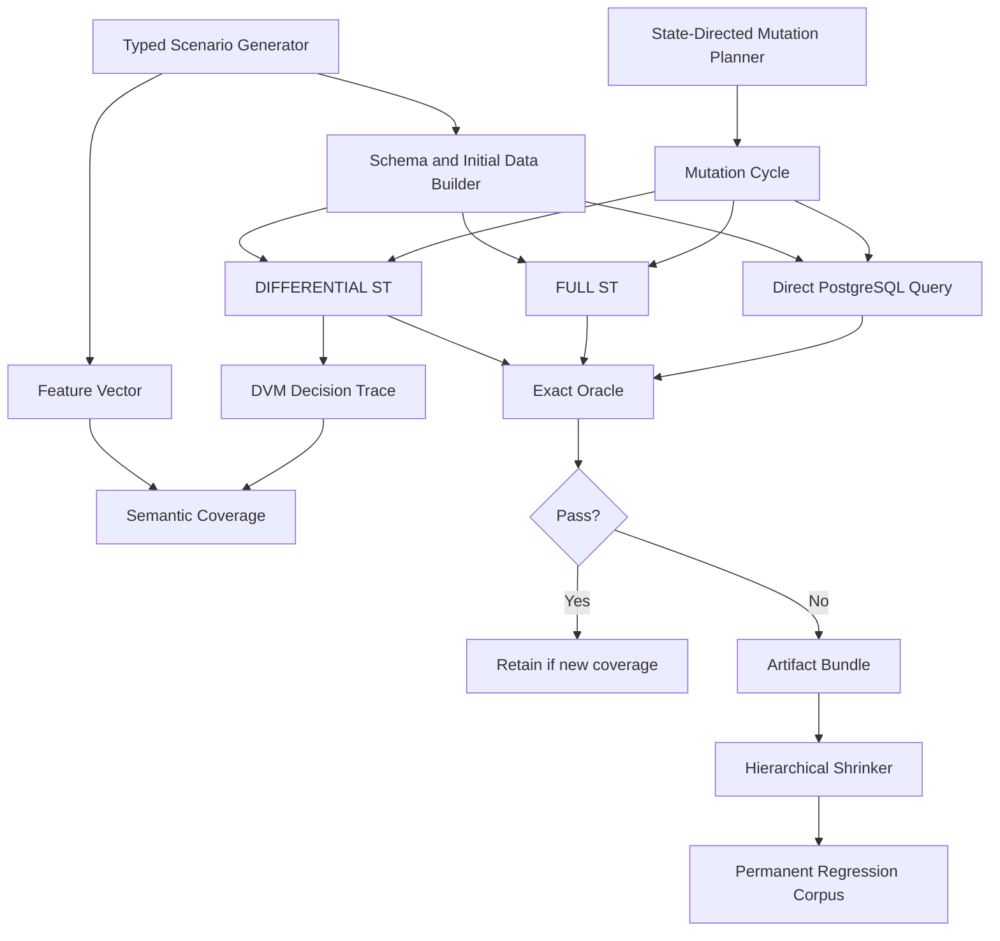

# Implementation Plan: Composition-Aware Differential Correctness Testing for `pg_trickle`

| Field | Value |
|---|---|
| Status | Proposed |
| Priority | P0 — correctness and release safety |
| Target repository | `trickle-labs/pg-trickle` |
| Path | `plans/PLAN_DVM_COMPOSITION_CORRECTNESS.md` |
| Related issue | [#938](https://github.com/trickle-labs/pg-trickle/issues/938) |
| Related fix | [#939](https://github.com/trickle-labs/pg-trickle/pull/939) |
| Baseline reviewed | `main` at `04f4cb212a55f003088d2b2d17d802d91802d19d` |
| PR reviewed | `0d3831f3b7737a3879f51590a345175e8d6f38f0` |
| Last updated | 2026-08-23 |

## 1. Executive summary

PR #939 exposed a class of failures that ordinary operator-by-operator tests are unlikely to catch. The failure was not merely “a `MAX()` bug” or “a `LEFT JOIN` bug.” It arose from the interaction of:

- column pruning,
- aggregate group-rescan reconstruction,
- CTE aliases,
- nested or chained joins,
- old-state versus new-state snapshots,
- outer-join NULL-padding transitions,
- and simultaneous changes to multiple source branches.

Two distinct defects were found in one reproduction:

1. A reconstructed old-state scan selected the physical table shape rather than the pruned logical shape, producing incompatible operands inside `EXCEPT ALL`.
2. A join subtree containing aggregate CTE leaves was treated as if it had an exact per-leaf pre-change snapshot. When multiple leaves changed in the same refresh, that assumption retained stale cross-product rows.

This plan establishes a defense-in-depth correctness program built around one non-negotiable property:

> After every accepted mutation cycle, the materialized DIFFERENTIAL result must be exactly equal to PostgreSQL’s direct evaluation of the defining query, as a multiset, with the expected schema, while genuinely using the intended incremental execution path.

No finite test suite can prove the absence of every possible defect. “Waterproof” in this plan means that the suite:

- uses exact oracles rather than proxies such as row counts;
- never converts product failures into skips or self-comparisons;
- generates operator compositions rather than isolated features;
- deliberately drives hard state transitions and simultaneous source changes;
- tests semantically equivalent execution histories and query rewrites;
- records semantic path coverage inside the DVM engine;
- produces complete deterministic reproducers and automatically minimizes them;
- and verifies its own sensitivity by deliberately reintroducing known defects.

The implementation should proceed in this order:

1. **Harden the oracle and failure classification.**
2. **Freeze #938/#939 as a mandatory sensitivity target.**
3. **Build a targeted “#938 neighborhood” generator.**
4. **Introduce a typed composition-aware query model.**
5. **Introduce state-directed, multi-source mutation generation.**
6. **Add metamorphic testing across refresh batching, query rewrites, and execution strategies.**
7. **Add schema contracts and structured snapshot planning inside the DVM engine.**
8. **Add semantic coverage, persistent corpus management, shrinking, and CI/release gates.**

The first two steps are urgent. Increasing the number of current fuzz cases before fixing the oracle would mostly create false confidence.

---

## 2. Why #938 escaped the existing suite

### 2.1 The current exact oracle already exists, but is not used consistently

`tests/e2e/property_support.rs` already contains a strong helper that:

- selects only user-visible columns;
- handles hidden set-operation count columns;
- compares with symmetric `EXCEPT ALL`;
- preserves duplicate multiplicity;
- and reports extra and missing rows.

That should become the single shared source of truth for all DVM correctness tests.

### 2.2 The current SQLancer-style correctness paths use row counts

As reviewed at the baseline commit:

- `run_equivalence_oracle` creates a **FULL** stream table and compares only `COUNT(*)` with the direct query.
- The light PR-mode equivalence oracle does the same.
- `run_diff_vs_full_oracle` compares only DIFFERENTIAL and FULL row counts.
- `run_stateful_dml_fuzzing` compares only row counts at checkpoints.

Equal row counts do not imply equal rows, values, NULL placement, or multiplicity. A stale row replacing a correct row passes a count-only oracle.

### 2.3 Runtime failures are frequently treated as skipped cases

In the current SQLancer-style tests, failures during stream-table creation or refresh often return `None`, increment `skipped`, and continue. That is acceptable only for a query rejected at the explicit admission boundary as unsupported. It is not acceptable after a query has been accepted for DIFFERENTIAL maintenance.

The exact #938 symptom—an error while generating or executing delta SQL—could therefore be classified as a skipped fuzz case rather than a discovered bug.

### 2.4 The stateful and diff-versus-full paths do not exercise multi-source changes well

The current diff-versus-full oracle applies four random mutations to only the first source table. The stateful soak chooses the first generated query it can support by creating only the first source table, which makes multi-table query selection ineffective. This structurally excludes or sharply reduces the simultaneous multi-source behavior that triggered the snapshot defect in #939.

### 2.5 The query generator is shallow and feature-oriented

The current generator chooses among:

- a simple projection,
- a simple filter,
- a single-table aggregate,
- a simple two-table INNER JOIN on `id`,
- or a single-table multi-aggregate.

It does not systematically generate:

- chained outer joins,
- aggregate CTE leaves,
- nested join subtrees,
- projections that narrow physical table width,
- definition aliases and reference aliases,
- nullable group or join keys,
- multiple changed leaves in one refresh,
- existing-group versus first-group transitions,
- or group-rescan aggregates composed with outer joins.

### 2.6 Current fuzzing terminology obscures two different systems

The repository has:

- a custom Rust “SQLancer-style” generator and oracle in `tests/e2e_sqlancer_tests.rs`;
- and an optional external Java SQLancer runner in `scripts/run_sqlancer.sh`.

These should be separated conceptually and operationally:

- **DVM composition fuzzer:** repository-owned, typed, stateful, aware of pg_trickle’s supported query subset and internal semantic paths.
- **External SQLancer:** broad PostgreSQL parser/crash and query-generation pressure, useful as a complementary source of SQL.

The internal correctness system should not depend on the external tool, and the external tool should not be expected to understand pg_trickle’s stateful refresh semantics without an adapter.

---

## 3. Goals and non-goals

### 3.1 Goals

The program must:

1. Detect incorrect values, missing rows, extra rows, duplicate-count errors, NULL-placement errors, and schema-shape errors.
2. Detect refresh-time SQL errors, backend crashes, panics, silent fallback, and partial application.
3. Exercise combinations of supported DVM operators, not only operators in isolation.
4. Drive meaningful state transitions rather than relying on uniform random DML.
5. Exercise simultaneous changes to multiple source leaves before one refresh.
6. Exercise both newly created and already materialized groups and matches.
7. Cover column pruning, aliases, wide physical tables, and narrow logical projections.
8. Validate DIFFERENTIAL against both:
   - the direct defining query; and
   - an independently maintained FULL baseline.
9. Produce deterministic, standalone reproducers with complete SQL and engine traces.
10. Minimize every new failure and permanently promote it into a regression corpus.
11. Measure semantic DVM path coverage and fail CI when mandatory paths disappear.
12. Prove that the test system catches known faults by running curated negative controls.
13. Run at several intensities: PR, main-branch, nightly, weekly deep, and release gate.
14. Keep the harness reliable enough that “test infrastructure failure” cannot masquerade as “product correctness.”

### 3.2 Non-goals

This plan does not initially attempt to:

- generate every valid PostgreSQL query;
- prove performance characteristics;
- replace focused unit and E2E regression tests;
- use approximate numeric equality by default;
- treat unsupported SQL as a product bug when it is rejected cleanly at admission;
- or build a full independent SQL interpreter.

PostgreSQL remains the semantic reference engine. The fuzzer’s state model exists to select meaningful mutations, not to compute expected query results independently.

---

## 4. Correctness invariants

Each invariant receives a stable identifier so test output, artifacts, and coverage reports can refer to it.

### I-01 — Output schema identity

For every accepted defining query, the user-visible stream-table result and the direct query result must have the same:

- number of columns;
- ordinal order;
- resolved PostgreSQL type OID;
- typmod where meaningful;
- collation where meaningful;
- and public output name after pg_trickle’s documented normalization.

This catches the category of defect where value comparison cannot even be expressed because the logical relation shapes diverge.

### I-02 — Exact multiset identity

After initialization and after every mutation cycle:

```text
DIFFERENTIAL_RESULT = DIRECT_QUERY_RESULT
```

as bags, not sets.

The symmetric difference must be empty:

```sql
(actual EXCEPT ALL expected)
UNION ALL
(expected EXCEPT ALL actual)
```

No row-count-only substitute is permitted.

### I-03 — Independent FULL baseline identity

For scenarios supported in DIFFERENTIAL mode:

```text
DIFFERENTIAL_RESULT = FULL_STREAM_TABLE_RESULT = DIRECT_QUERY_RESULT
```

The direct query catches errors shared by both refresh modes. The FULL stream table catches harness mistakes involving stream-table storage, output columns, or refresh orchestration.

### I-04 — Genuine incremental execution

A case intended to test DIFFERENTIAL must confirm the effective mode actually used. Silent fallback to FULL is a test failure unless the scenario explicitly declares fallback as the expected behavior.

Accepted equivalent incremental-family modes, such as a documented append-only optimization, must be declared by the scenario capability model rather than accepted generically.

### I-05 — Accepted-query refresh totality

Once DIFFERENTIAL creation/admission succeeds, every subsequent refresh must produce one of:

- a successful result;
- or a specifically injected and expected failure in a fault-recovery test.

An ordinary generated scenario must never turn a refresh error into a skip.

### I-06 — Cycle-level consistency

The oracle runs:

- after initial population;
- after every mutation batch;
- after every explicit refresh;
- and after recovery from an expected injected failure.

Checking only at the end of a long trace is insufficient because later mutations can hide earlier corruption.

### I-07 — Refresh idempotence

With no new source changes:

```text
refresh(); result_1
refresh(); result_2
result_1 = result_2
```

The second refresh must not generate additional visible changes, duplicate rows, timestamp drift beyond documented metadata behavior, or a different result.

### I-08 — Batching invariance

Given identical starting databases and a final identical base-table state:

```text
A → refresh → B → refresh
```

must converge to the same result as:

```text
A + B → one refresh
```

when A and B are valid base-table mutations whose final state is order-compatible.

This directly targets incorrect assumptions about pre-change snapshots and simultaneous deltas.

### I-09 — UPDATE decomposition invariance

For mutations with equivalent final base-table state:

```text
UPDATE old_row → new_row
```

must converge to the same result as:

```text
DELETE old_row
INSERT new_row
```

This targets D/I decomposition, changed-key handling, group movement, and join-key movement.

### I-10 — Irrelevant physical-column invariance

Adding unused physical columns, changing their values, or widening the source table must not alter:

- the generated logical output schema;
- refresh success;
- or query results.

This directly targets column-pruning and rescan-shape bugs.

### I-11 — Atomicity and recovery

If a refresh fails:

- the visible stream table must remain at the last committed correct state;
- the frontier and refresh metadata must not advance incorrectly;
- transient internal tables or flags must be cleaned up;
- and a subsequent successful refresh must converge to the direct query.

### I-12 — Deterministic replay

A serialized scenario containing the same:

- generator version,
- seed,
- schema,
- initial rows,
- query,
- mutation cycles,
- and execution knobs

must reproduce the same feature vector and failure classification.

A seed alone is not a sufficient long-term artifact because generators evolve.

---

## 5. Failure classification: fail closed for correctness

Introduce a typed classification rather than using `Option` and free-form string matching.

```rust
enum CaseOutcome {
    Passed(PassReport),
    UnsupportedAtAdmission(UnsupportedReason),
    GeneratorInvalid(GeneratorError),
    ProductFailure(ProductFailure),
    InfrastructureFailure(InfrastructureFailure),
}
```

### 5.1 Allowed skip

Only `UnsupportedAtAdmission` is a normal skip, and only when all of the following are true:

1. The failure occurs while checking or creating the defining query, before any successful DIFFERENTIAL admission.
2. The SQLSTATE or structured pg_trickle error maps to an explicit unsupported-feature reason.
3. The reason is recorded in capability coverage.
4. The query was syntactically and semantically valid in PostgreSQL itself.

A high or increasing unsupported rate is reported and bounded; otherwise the generator can appear healthy while exercising little supported functionality.

### 5.2 Product failures

The following always fail the case:

- schema mismatch;
- exact multiset mismatch;
- refresh-time SQL error after admission;
- backend disconnect, PANIC, or process crash;
- silent fallback to an unapproved mode;
- partial application or failed recovery;
- a direct query that succeeds while generated differential SQL fails;
- a FULL baseline that differs from the direct query;
- a generated delta that violates an internal schema contract;
- or nondeterministic replay.

### 5.3 Infrastructure failures

Examples include Docker startup failure, disk exhaustion outside an intentional resource test, unavailable test image, or harness connection failure before scenario setup.

Infrastructure failures must fail the CI job and preserve diagnostics. They must not be counted as passed or skipped product cases.

### 5.4 Generator failures

Examples include invalid SQL, impossible foreign-key inserts, ineffective mutations, duplicate object names, or generation of a feature declared supported by the model but not represented correctly in SQL.

Generator failures fail development and PR jobs. In long exploratory jobs they are counted separately and subject to a zero or near-zero threshold. Silently ignoring failed DML is prohibited.

---

## 6. Target test architecture



The architecture has nine layers:

1. **Typed scenario model**
2. **Exact schema and multiset oracle**
3. **State-directed multi-source mutation planner**
4. **Composition-aware query generator**
5. **Metamorphic test runner**
6. **DVM internal contracts and decision tracing**
7. **Semantic coverage and corpus retention**
8. **Failure artifact generation and shrinking**
9. **Tiered CI and release gates**

---

## 7. Workstream 0 — Freeze #938/#939 and prove test sensitivity

### Objective

Turn #938/#939 into a mandatory benchmark for the new system before broadening the search space.

### Tasks

- [ ] Keep the focused regression tests introduced by PR #939.
- [ ] Add a serialized scenario equivalent to the original issue reproduction.
- [ ] Add a reduced integer-key version that preserves the logical failure.
- [ ] Add a wide-table/narrow-projection version.
- [ ] Add a simultaneous-two-aggregate-branch version that detects stale rows without relying on a SQL arity error.
- [ ] Add a replay recipe that runs these scenarios against any selected commit.
- [ ] Record the expected failure signature on the parent commit.
- [ ] Confirm all scenarios pass on the fixed commit.

### Mandatory negative controls

The test suite is not accepted until it detects each intentionally reintroduced defect independently:

1. **Physical-width rescan defect.** Revert the aggregate rescan from projecting
   `Scan.columns` to selecting the whole physical relation. Expected detection:
   schema/set-operation error.

2. **Incorrect CTE-leaf snapshot capability.** Treat `CteScan` as exact per-leaf
   reconstructible. Expected detection: exact multiset divergence under
   simultaneous branch changes.

3. **Wrong old-state source for outer-join first-match transition.** Use the
   post-change left relation where the pre-change relation is required. Expected
   detection: stale or missing NULL-padded rows.

4. **Lost CTE definition/reference alias mapping.** Remove alias reconstruction
   during aggregate rescan. Expected detection: refresh SQL error or wrong group
   values.

5. **NULL-unsafe group correlation.** Replace `IS NOT DISTINCT FROM` with `=` in
   rescan correlation. Expected detection: nullable-group scenario divergence.

Each negative control should be represented as a small patch under a test-only directory, for example:

```text
tests/negative_controls/
  nc01_rescan_physical_width.patch
  nc02_cte_leaf_per_leaf_snapshot.patch
  nc03_outer_join_wrong_l0.patch
  nc04_cte_alias_loss.patch
  nc05_null_unsafe_rescan.patch
```

A scheduled and release-gate script applies each patch in an isolated worktree and asserts that the designated correctness job fails for the expected reason.

### Exit criteria

- All five negative controls are detected.
- Both root causes from #939 have independent failing tests.
- The fixed cases are present in the permanent regression corpus.
- No case depends solely on matching row counts.

---

## 8. Workstream 1 — Build one exact, shared correctness oracle

### Objective

Replace every count-based or ad hoc comparator with a shared exact oracle used by E2E, property, fuzz, regression-corpus, and metamorphic tests.

### Proposed files

```text
tests/e2e/oracle.rs                 # new
tests/e2e/property_support.rs       # delegate to oracle.rs
tests/e2e/mod.rs                    # export oracle
tests/e2e/light.rs                  # expose equivalent helpers
tests/e2e_sqlancer_tests.rs         # remove count-only comparisons
tests/e2e_diff_full_equivalence_tests.rs
```

### Proposed API

```rust
pub struct RelationSignature {
    pub columns: Vec<ColumnSignature>,
}

pub struct ColumnSignature {
    pub ordinal: usize,
    pub name: String,
    pub type_oid: u32,
    pub typmod: i32,
    pub collation_oid: Option<u32>,
}

pub struct RelationDiff {
    pub actual_count: i64,
    pub expected_count: i64,
    pub extra_count: i64,
    pub missing_count: i64,
    pub extra_rows: Vec<String>,
    pub missing_rows: Vec<String>,
    pub actual_signature: RelationSignature,
    pub expected_signature: RelationSignature,
}

pub async fn compare_st_to_query(
    db: &E2eDb,
    st_name: &str,
    defining_query: &str,
) -> Result<(), RelationDiff>;

pub async fn compare_sts(
    db: &E2eDb,
    left_st: &str,
    right_st: &str,
) -> Result<(), RelationDiff>;
```

### Schema comparison design

Use SQLx statement metadata or PostgreSQL row-description metadata to resolve the direct query’s output types without requiring rows to exist. Compare that metadata with the stream table’s user-visible columns from `pg_attribute`/`pg_type`, not merely `information_schema.data_type`.

Schema comparison occurs before value comparison. The failure report must identify the first mismatched ordinal and show:

```text
ordinal 3:
  actual   = latest_d timestamptz(1184)
  expected = latest_d text(25)
```

### Value comparison design

1. Build an ordinal alias list (`__pgt_c1`, `__pgt_c2`, …) so duplicate or rewritten output names cannot corrupt the comparator.
2. Exclude internal `__pgt_*` columns from the stream-table side.
3. Apply documented visibility predicates for set-operation storage.
4. Prefer native PostgreSQL equality and `EXCEPT ALL`.
5. For types without a set-operation equality operator, use an explicit type adapter after schema identity has already been established.
6. Never fall back to row counts.

A robust wrapper shape is:

```sql
WITH
actual AS (
    SELECT actual_col_1 AS __pgt_c1,
           actual_col_2 AS __pgt_c2
    FROM public.target_st
),
expected AS (
    SELECT *
    FROM (<defining query>) AS q(__pgt_c1, __pgt_c2)
),
difference AS (
    (TABLE actual EXCEPT ALL TABLE expected)
    UNION ALL
    (TABLE expected EXCEPT ALL TABLE actual)
)
SELECT NOT EXISTS (SELECT 1 FROM difference);
```

### Type adapters

Maintain a small registry keyed by output type OID or type category.

- Native comparison for ordinary scalar, array, range, enum, domain, timestamp, interval, numeric, and textual types where PostgreSQL supports equality.
- Canonical `jsonb` representation for `json`.
- Exact `jsonb` equality for `jsonb`.
- `XMLSERIALIZE(... AS text)` for XML.
- Explicit, reviewed adapters for extension types that lack equality.
- Unsupported comparator types must produce `OracleUnsupportedType`, not a pass.

Approximate floating-point comparison is not the default. PostgreSQL equality semantics are the reference. Any tolerance-based test must be a separately named numerical-stability test.

### Oracle self-tests

Add unit/E2E tests proving the oracle detects:

- same count, different row;
- same rows, different duplicate multiplicity;
- one extra NULL row;
- wrong value in one column;
- wrong column order;
- wrong type with textually similar values;
- empty-versus-empty;
- JSON key-order equivalence where appropriate;
- and an unsupported comparison type.

### Required migration

Replace all current uses of:

```rust
SELECT COUNT(*) ...
```

as a semantic oracle in:

- SQLANCER-2;
- SQLANCER-LIGHT-2;
- SQLANCER-3;
- SQLANCER-4;
- and any future fuzz job.

Counts remain useful diagnostic fields only.

### Exit criteria

- One shared oracle implementation is used everywhere.
- There is no count-only correctness assertion in the DVM fuzzing paths.
- Oracle self-tests include a same-count/different-content negative case.
- Failure output contains concrete extra and missing rows.

---

## 9. Workstream 2 — Refactor the internal fuzzer into a durable scenario framework

### Objective

Replace a monolithic test file and seed-only replay with a versioned, serializable scenario framework.

### Proposed module layout

```text
tests/e2e/dvm_fuzz/
  mod.rs
  model.rs          # serializable scenario and feature types
  rng.rs            # deterministic versioned RNG
  schema.rs         # schema generation and DDL
  query.rs          # typed relational query model and SQL rendering
  data.rs           # initial data generation
  mutation.rs       # state-directed mutation planning
  oracle.rs         # scenario-level orchestration around shared oracle
  runner.rs         # setup, refresh, compare, cleanup
  coverage.rs       # semantic feature coverage
  artifact.rs       # repro bundle generation
  shrink.rs         # hierarchical minimization
  capability.rs     # supported/unsupported classification
```

Create dedicated test binaries:

```text
tests/e2e_dvm_composition_tests.rs
tests/e2e_dvm_fuzz_tests.rs
tests/e2e_dvm_metamorphic_tests.rs
tests/e2e_dvm_corpus_tests.rs
```

Keep `tests/e2e_sqlancer_tests.rs` only for the external SQLancer adapter or rename the internal system to avoid ambiguity.

### Scenario format

```rust
#[derive(Serialize, Deserialize)]
pub struct Scenario {
    pub format_version: u32,
    pub generator_version: String,
    pub seed: u64,
    pub schema: SchemaSpec,
    pub initial_data: Vec<TableRows>,
    pub query: QuerySpec,
    pub cycles: Vec<MutationCycle>,
    pub execution: ExecutionKnobs,
    pub expected_capability: ExpectedCapability,
    pub features: FeatureVector,
}
```

### Required scenario properties

- Fully deterministic object and row identifiers.
- Unique schema namespace per case.
- No dependence on wall-clock timestamps, random UUID functions, or nondeterministic row choice.
- Every DML statement includes `RETURNING` or an equivalent row-count assertion.
- Every cycle states exactly which source leaves changed.
- The scenario records whether a group/match existed before each mutation.
- The serialized scenario is sufficient to render `setup.sql`, `query.sql`, and `mutations.sql`.

### Resource and cleanup model

Use a per-case schema:

```text
dvmf_<short_seed>_<case_index>
```

On completion:

```sql
DROP SCHEMA ... CASCADE;
```

Cleanup runs in a guard/finalizer even after failures. A cleanup failure is recorded separately and must not erase the original failure.

For long jobs, reuse a bounded number of test databases but isolate scenarios by schema. Periodically check:

- relation count;
- temporary-file usage;
- change-buffer table count;
- active background workers;
- and `/dev/shm` pressure where observable.

### Exit criteria

- A failing case can be replayed from `scenario.json` without the original generator.
- The harness has typed outcomes rather than `Option`.
- Failed DML cannot be silently ignored.
- A single source file no longer contains generator, runner, oracle, and soak logic.

---

## 10. Workstream 3 — Build the targeted “#938 neighborhood” generator

### Objective

Search the high-risk local neighborhood around the discovered defect before attempting broad SQL generation.

This generator should be deterministic, small-data, exact-oracle, and heavily biased toward compositions involving old-state reconstruction.

### 10.1 Dimension model

| Dimension | Values |
|---|---|
| Join depth | 1, 2, 3, 4 |
| Join kind | INNER, LEFT, RIGHT-normalized, FULL |
| Join shape | left-deep, right-deep, balanced |
| Aggregate strategy | algebraic, extrema rescan, ordered rescan, collection rescan, mixed |
| Aggregate functions | COUNT, SUM, AVG, MIN, MAX, BOOL_AND/OR, STRING_AGG, ARRAY_AGG, JSONB_AGG, statistical aggregate |
| Group lifecycle | absent, first row, existing singleton, existing multi-row, winner replacement, last-row deletion |
| Changed leaves per cycle | one, two, all |
| DML kind | insert, delete, value update, group-key update, join-key update, mixed D/I |
| Physical width | minimal, 5 columns, 20 columns, 50 columns |
| Logical width | all, half, minimal required |
| Query representation | CTE, CTE with definition aliases, aliased CTE reference, inline subquery, nested subquery |
| Key type | integer, bigint, text, UUID |
| Key nullability | non-null, nullable group key, nullable join key |
| Constraints | none, PK only, PK+FK, FK with cascade |
| Match multiplicity | zero, one, many |
| Initial outer-join state | unmatched, matched, mixed |
| Refresh state | first refresh, already populated group, multiple prior cycles |
| Source-change order | left then right, right then left, same transaction |
| Application strategy | automatic, forced MERGE where supported, explicit-DML path where supported |
| Prepared statements | enabled, disabled |
| Materialization | default, paths that request NOT MATERIALIZED |

### 10.2 Mandatory P0 combinations

These are not probabilistic; every PR run must execute them.

1. Two chained LEFT JOINs onto two aggregate CTEs, at least one rescan aggregate, wide source tables, narrow projections, existing parent row, first child insert.
2. The same topology with both aggregate leaves changed before one refresh.
3. One algebraic aggregate branch and one rescan branch.
4. Two rescan branches using different families, such as `MAX` and ordered `STRING_AGG`.
5. Existing multi-row group where the current MIN/MAX winner is updated.
6. Existing group where the winner is deleted.
7. Singleton group transitioning to empty and back to populated.
8. Nullable group key, including NULL-to-value and value-to-NULL update.
9. CTE definition aliases plus a different reference alias.
10. Nested `(scan JOIN aggregate_cte)` subtree used as one side of an outer join.
11. FULL JOIN variants with simultaneous branch changes.
12. INNER JOIN chain with duplicate matches to verify bag multiplicity.
13. Join-key update and aggregate-value update in the same cycle.
14. Three aggregate leaves changed in one refresh.
15. Four-level left-deep join where a deep aggregate CTE leaf changes.
16. Physical source widening by unused columns with no logical query change.
17. Equivalent inline-subquery and CTE forms.
18. Two refresh histories with the same final base state but different batching.

### 10.3 Combinatorial strategy

Do not execute the full Cartesian product. Use three layers:

1. **Mandatory triples and quadruples** based on known risk:
   - outer join × rescan aggregate × pruned width × existing group;
   - CTE leaf × simultaneous changes × old-snapshot reconstruction;
   - nullable key × group rescan × update/delete;
   - duplicate match × outer-join transition × multi-source DML.

2. **Pairwise covering array** for the remaining dimensions.

3. **Coverage-guided random extension** that retains cases reaching new semantic buckets.

Implement a deterministic greedy covering-array builder in Rust or use a small reviewed dependency. The generated set and uncovered tuples must be emitted in `coverage.json`.

### Exit criteria

- Every mandatory P0 combination runs on each PR.
- Pairwise coverage reaches 100% for the declared P0 dimension subset.
- The generator discovers both #939 defects when each negative control is applied.
- At least one scenario catches a silent wrong-result defect, not only a PostgreSQL SQL error.

---

## 11. Workstream 4 — Introduce a typed, composition-aware query generator

### Objective

Generate valid supported query trees with known output schemas and explicit semantic features.

### 11.1 Generate a relational AST, not SQL strings first

```rust
enum RelNode {
    Scan(ScanSpec),
    Filter { input: Box<RelNode>, predicate: Predicate },
    Project { input: Box<RelNode>, expressions: Vec<ProjectExpr> },
    Aggregate { input: Box<RelNode>, groups: Vec<Expr>, aggs: Vec<AggSpec> },
    InnerJoin { left: Box<RelNode>, right: Box<RelNode>, on: JoinPredicate },
    LeftJoin { left: Box<RelNode>, right: Box<RelNode>, on: JoinPredicate },
    FullJoin { left: Box<RelNode>, right: Box<RelNode>, on: JoinPredicate },
    CteRef { id: CteId, alias: String, column_aliases: Vec<String> },
    Subquery { input: Box<RelNode>, alias: String },
    UnionAll { left: Box<RelNode>, right: Box<RelNode> },
    ExceptAll { left: Box<RelNode>, right: Box<RelNode> },
}
```

Every node computes a logical `RelationSchema` during generation. Invalid compositions are rejected before rendering SQL.

### 11.2 Generator waves

#### Wave A — high-confidence core

- Scan
- Filter
- Project
- Aggregate
- INNER/LEFT/FULL JOIN
- CTE and subquery wrappers

#### Wave B — multiplicity and existence

- DISTINCT
- UNION ALL
- EXCEPT ALL
- INTERSECT ALL
- semi-join/anti-join forms
- HAVING

#### Wave C — broader supported operators

- windows;
- scalar and lateral subqueries;
- grouping sets;
- Top-K;
- recursive CTEs;
- supported set-returning functions.

Each wave is enabled only after:

- exact oracle support;
- focused seed corpus;
- failure classification;
- and semantic feature tracing exist for that operator family.

### 11.3 Generation constraints

- Limit tree depth in PR jobs; increase it in deep jobs.
- Prefer small cardinalities with duplicate-producing keys.
- Ensure every selected aggregate has a compatible input type.
- Ensure join predicates reference compatible types.
- Ensure output names are unique or intentionally test documented name normalization.
- Bias toward projections that remove unused source columns.
- Bias toward wrappers around joins and aggregates because composition is the target.
- Record why each node was selected and the resulting feature vector.

### 11.4 Query normalization and rendering

The same AST should render several semantically equivalent forms:

- CTE versus inline subquery;
- different safe aliases;
- left-deep versus equivalent reordered INNER JOIN;
- explicit column lists versus inherited names;
- parenthesized versus flattened projections.

This supports metamorphic testing without needing a second arbitrary query generator.

### Exit criteria

- The generator can produce all mandatory #938-neighborhood shapes.
- Every generated query parses and executes directly in PostgreSQL.
- Invalid SQL is a generator failure, not a skipped product case.
- Every generated query has a computed logical schema before execution.

---

## 12. Workstream 5 — Build a state-directed multi-source mutation planner

### Objective

Generate mutations that deliberately cross DVM semantic boundaries.

Uniform random DML spends too much time changing rows that do not affect the query or remain in the same easy state. The planner should maintain enough base-table state to choose meaningful operations.

### 12.1 State tracked per source

- live row IDs;
- group-key values;
- join-key values;
- current rows per group;
- current MIN/MAX winner candidates;
- current match multiplicity across join edges;
- whether a parent is unmatched, singly matched, or multiply matched;
- nullable-key rows;
- and last mutation cycle for each leaf.

This is not an expected-result engine. PostgreSQL still computes the truth.

### 12.2 Mutation intents

```rust
enum MutationIntent {
    CreateNewGroup,
    AddToExistingGroup,
    DeleteLastRowOfGroup,
    ReplaceMinWinner,
    ReplaceMaxWinner,
    MoveRowBetweenGroups,
    CreateFirstJoinMatch,
    RemoveLastJoinMatch,
    IncreaseJoinMultiplicity,
    DecreaseJoinMultiplicity,
    MoveRowBetweenJoinPartners,
    NullToValueKey,
    ValueToNullKey,
    ChangeAggregateValueOnly,
    ChangeKeyAndValueTogether,
    NoOpReferencedColumns,
    ChangeUnusedColumnOnly,
}
```

### 12.3 Cycle templates

Every generated scenario should include a selected subset of these templates:

1. One source changes.
2. Two independent sources change before one refresh.
3. All sources change before one refresh.
4. INSERT and DELETE occur in the same source and group.
5. UPDATE moves a row between groups.
6. UPDATE moves a row between join partners.
7. Parent and child change in the same cycle.
8. An aggregate winner changes while another joined aggregate branch changes.
9. A matched outer-join row becomes unmatched.
10. An unmatched row gains its first match.
11. A group becomes empty.
12. A no-op refresh follows a non-empty cycle.

### 12.4 Effective-DML enforcement

Every DML statement must use `RETURNING` or verify affected-row count. If a planned operation affects zero rows, the case is a generator failure and is not allowed to continue.

DML errors are never ignored.

### 12.5 Multi-source selection

Choose changed leaves from the full source set. The fuzzer must report:

```text
changed_leaf_count
changed_leaf_ids
same_transaction
mutation_intents
```

Coverage gates must include one, two, and all-leaf cycles for applicable topologies.

### 12.6 Check frequency

For ordinary generated scenarios, compare after every cycle.

For very long soaks, define a cycle as a bounded batch of mutations and compare after every batch. Do not defer comparison for dozens of arbitrary mutations when the goal is localization and shrinking.

### Exit criteria

- Multi-table scenarios mutate all represented sources over a trace.
- The suite guarantees simultaneous multi-source cycles.
- Every mutation is effective and recorded.
- Group and outer-join boundary transitions are explicit coverage dimensions.

---

## 13. Workstream 6 — Add metamorphic correctness testing

### Objective

Use transformations that preserve expected semantics but stress different DVM paths. Metamorphic tests are especially valuable where no independent implementation of incremental maintenance exists.

### M-01 — Refresh batching

Compare cloned starting states:

- branch A: mutate source X, refresh, mutate source Y, refresh;
- branch B: mutate X and Y, refresh once.

Final direct-query and stream-table results must all agree.

### M-02 — UPDATE versus DELETE+INSERT

Execute an UPDATE in one clone and the equivalent D/I pair in another. Cover:

- value-only update;
- group-key update;
- join-key update;
- nullable-key transition;
- and key plus aggregate value together.

### M-03 — CTE versus inline subquery

Render the same relational AST once with named CTEs and once with nested subqueries.

### M-04 — Alias renaming

Systematically rename:

- table aliases;
- CTE definition columns;
- CTE reference aliases;
- projected output aliases.

Result and schema must remain equivalent according to PostgreSQL semantics.

### M-05 — Irrelevant-column widening

Clone a scenario and add unused columns with generated values to one or more source tables. The defining query’s result and refresh behavior must remain identical.

### M-06 — Safe INNER JOIN reordering

For pure inner equijoins without volatile expressions, render equivalent join orders and compare results after the same mutation trace.

### M-07 — Projection push/pull

For safe expressions, compare a projection placed inside a subquery with the equivalent projection outside it.

### M-08 — Refresh idempotence

Run a second refresh with no source changes and verify exact equality and no visible delta.

### M-09 — No-op source mutation

Update only unused columns, or assign a referenced column to its existing value where PostgreSQL still emits an UPDATE event. The final result must remain correct and stable.

### M-10 — Source mutation ordering

For commuting operations in one transaction, change execution order while preserving final base state.

### M-11 — Execution-strategy equivalence

Run the same serialized scenario under supported strategy combinations:

- prepared statements enabled/disabled;
- planner strategy automatic/forced variants;
- aggregate fast path enabled/disabled;
- merge/application strategy variants;
- relevant materialization choices;
- and, in later phases, trigger CDC versus WAL CDC and deferred versus IMMEDIATE mode.

Each strategy run must still satisfy the direct-query oracle. The expected effective mode and strategy are recorded.

### M-12 — Query wrapper invariance

Add harmless subquery wrappers or explicit casts that preserve resolved output types and compare behavior.

### Exit criteria

- Batching invariance is part of the PR gate for #938-neighborhood cases.
- At least six metamorphic families run in nightly CI.
- Strategy equivalence never accepts fallback-to-self baselines.
- Metamorphic failures serialize both branches and their shared origin.

---

## 14. Workstream 7 — Add schema contracts and snapshot planning inside the DVM engine

External testing should be backed by internal contracts so shape errors fail early and explain themselves.

### 14.1 Replace name-only output metadata with a relation schema

`DiffResult` currently exposes `columns: Vec<String>`. Introduce:

```rust
pub struct RelationSchema {
    pub columns: Vec<DiffColumn>,
}

pub struct DiffColumn {
    pub name: String,
    pub type_oid: u32,
    pub typmod: i32,
    pub nullable: bool,
    pub provenance: ColumnProvenance,
}
```

`DiffResult` should carry `schema: RelationSchema`. A compatibility accessor can expose names during migration.

### 14.2 Centralize set-operation construction

All generated `UNION`, `INTERSECT`, and `EXCEPT` paths should call a typed builder:

```rust
fn build_set_operation(
    op: SetOperation,
    left_sql: &str,
    left_schema: &RelationSchema,
    right_sql: &str,
    right_schema: &RelationSchema,
) -> Result<TypedSql, PgTrickleError>;
```

The builder rejects:

- arity mismatch;
- ordinal type mismatch;
- incompatible alias mapping;
- or unexpected internal columns.

The resulting error includes operator path and both schemas. Raw `format!` construction of set operations should be audited and progressively removed.

### 14.3 Model snapshot capability explicitly

A boolean such as “use pre-change snapshot” hides materially different strategies. Introduce an explicit plan:

```rust
enum SnapshotPlan {
    ExactPerLeaf,
    ExactCombined,
    PostChangeWithCorrection,
    Unsupported { reason: SnapshotUnsupportedReason },
}
```

The planner traverses the subtree and returns a reasoned result. Examples:

- a pure scan join tree may support `ExactPerLeaf`;
- a join containing aggregate CTE scans may require `ExactCombined`;
- a semi-join context may require `PostChangeWithCorrection`;
- an unsupported operator composition returns a structured reason.

Operator code consumes the plan rather than recomputing overlapping booleans.

### 14.4 Attach operator paths to generated relations

Every node should have a stable path such as:

```text
root.left.left.cte[1].aggregate.rescan
```

Use it in:

- schema errors;
- snapshot-plan traces;
- generated CTE comments in test mode;
- and failure artifacts.

### 14.5 Add a test-only DVM decision trace

Under a test feature or explicit test GUC, emit structured JSON containing:

```json
{
  "operator_path": "root.left",
  "operator": "LeftJoin",
  "output_schema": ["parent_id:int4", "cnt:int8"],
  "snapshot_plan": "ExactCombined",
  "aggregate_strategy": null,
  "pruned_physical_columns": 7,
  "logical_columns": 2,
  "delta_cte": "__pgt_delta_12"
}
```

The trace must include:

- operator kinds and depth;
- aggregate strategy;
- snapshot plan;
- set-operation schema checks;
- CTE cache hits;
- per-leaf versus combined reconstruction;
- correction-term selection;
- materialization decisions;
- and effective apply strategy.

This is essential for semantic coverage and failure diagnosis.

### 14.6 Preflight generated delta SQL in tests

Before applying a generated delta in fuzz/test mode:

- prepare or `EXPLAIN` the SQL;
- capture PostgreSQL’s resolved row description;
- compare it with the expected `DiffResult.schema`;
- then execute it.

This separates code-generation shape failures from merge/application failures.

### 14.7 Production behavior

Contracts that can be checked cheaply should remain in production and return structured `PgTrickleError` values. Expensive tracing and redundant preflight should remain test/debug options.

### Exit criteria

- Set-operation shape mismatches are caught in Rust before opaque PostgreSQL errors where possible.
- Snapshot strategy is a structured plan, not a collection of loosely coupled booleans.
- The fuzzer can assert which snapshot path was actually exercised.
- Every generated final delta has a declared and verified schema.

---

## 15. Workstream 8 — Measure semantic coverage

Code coverage is useful but insufficient. The suite must know whether it exercised the semantic combinations associated with DVM correctness.

### 15.1 Feature vector

```rust
pub struct FeatureVector {
    pub operator_multiset: BTreeMap<OperatorKind, usize>,
    pub max_operator_depth: usize,
    pub join_kinds: BTreeSet<JoinKind>,
    pub join_shape: JoinShape,
    pub aggregate_families: BTreeSet<AggregateFamily>,
    pub has_group_rescan: bool,
    pub has_cte_leaf_inside_join: bool,
    pub has_column_pruning: bool,
    pub physical_width_bucket: WidthBucket,
    pub logical_width_bucket: WidthBucket,
    pub nullable_group_key: bool,
    pub nullable_join_key: bool,
    pub duplicate_match_bucket: MultiplicityBucket,
    pub group_lifecycle_events: BTreeSet<GroupLifecycle>,
    pub outer_join_transitions: BTreeSet<OuterJoinTransition>,
    pub changed_leaf_count_bucket: ChangedLeafBucket,
    pub snapshot_plans: BTreeSet<SnapshotPlanKind>,
    pub apply_strategy: ApplyStrategy,
    pub prepared_statements: bool,
    pub cdc_mode: CdcMode,
}
```

### 15.2 Coverage sources

Combine:

1. **Generator-declared features**
2. **Observed base-state transitions**
3. **DVM decision trace**
4. **Outcome classification**
5. **Traditional Rust line/branch coverage as a secondary metric**

The observed engine trace is authoritative for strategy/path coverage.

### 15.3 Coverage buckets

Maintain three sets:

- **Mandatory buckets:** must all be hit in PR or release jobs.
- **Pairwise buckets:** combinations across selected dimensions.
- **Exploratory buckets:** retained when newly discovered but not yet gated.

### 15.4 Initial coverage floors

PR gate:

- 100% of mandatory #938-neighborhood buckets;
- 100% of declared P0 pairwise combinations;
- all snapshot-plan kinds applicable to P0;
- changed-leaf buckets `{1, 2, all}`;
- all group lifecycle transitions used by MIN/MAX rescan;
- matched↔unmatched outer-join transitions.

Main/nightly:

- 100% mandatory core buckets;
- at least 95% of declared core pairwise buckets;
- no unexpected drop from the committed coverage baseline;
- bounded unsupported-at-admission rate.

Coverage floors should be versioned in:

```text
tests/corpus/dvm_coverage_requirements.json
```

### 15.5 Corpus retention

Retain a generated scenario when it:

- hits a new semantic bucket;
- hits a new pairwise combination;
- reaches a new DVM decision path;
- produces a new structured unsupported reason;
- or fails.

Periodically minimize redundant passing corpus entries with a greedy set-cover pass while preserving all required coverage.

### Exit criteria

- CI publishes `coverage.json` and a human-readable Markdown summary.
- A test can fail because a mandatory DVM path was not exercised.
- The corpus is selected by semantic contribution, not merely seed chronology.

---

## 16. Workstream 9 — Build complete failure artifacts and an automatic shrinker

### 16.1 Artifact bundle

Every failure must create:

```text
artifacts/dvm-fuzz/<run>/<case>/
  scenario.json
  feature_vector.json
  coverage.json
  setup.sql
  defining_query.sql
  mutations.sql
  replay.sql
  replay.sh
  actual_rows.jsonl
  expected_rows.jsonl
  extra_rows.jsonl
  missing_rows.jsonl
  actual_schema.json
  expected_schema.json
  dvm_trace.json
  generated_delta.sql
  postgres.log
  failure.json
  environment.txt
```

`failure.json` contains:

- invariant ID;
- outcome class;
- SQLSTATE;
- operator path;
- cycle and mutation index;
- mismatch counts and hashes;
- seed and generator version;
- git SHA;
- PostgreSQL and extension version;
- execution knobs.

### 16.2 Replay command

Add:

```bash
just dvm-replay path/to/scenario.json
```

The replay must run without regenerating the scenario. Optional flags select:

- commit/build under test;
- exact cycle;
- trace verbosity;
- and strategy overrides.

### 16.3 Shrinking order

Use hierarchical delta debugging:

1. Remove later cycles after the first failing cycle.
2. Remove mutation statements within the failing cycle.
3. Replace UPDATEs with simpler value changes where the failure persists.
4. Remove initial rows.
5. Remove source tables not required by the query.
6. Remove query wrappers.
7. Remove join branches.
8. Reduce join depth.
9. Remove aggregate outputs.
10. Reduce aggregate family complexity.
11. Remove projected columns.
12. Remove unused physical columns.
13. Simplify aliases.
14. Simplify types: UUID → bigint → integer where failure persists.
15. Remove constraints.
16. Reduce key cardinality and duplicates.
17. Simplify execution knobs.

Each candidate is accepted only if it preserves a compatible failure signature, not merely any failure.

### 16.4 Failure signatures

Examples:

```text
SchemaMismatch(operator_path, left_arity, right_arity)
RefreshSqlState(sqlstate, operator_path)
MultisetMismatch(extra_hash, missing_hash, first_failing_cycle)
BackendCrash(signal_or_log_fingerprint)
SilentFallback(expected_mode, actual_mode)
```

The shrinker may relax row hashes as rows simplify but should preserve invariant ID, failure class, and operator-path family.

### 16.5 Corpus promotion

After minimization:

1. Store the scenario in `tests/corpus/dvm_regressions/`.
2. Add a short README entry with issue/PR and root cause.
3. Add a focused named E2E test when the scenario teaches a stable behavior.
4. Add the seed to the exploratory corpus only as a convenience; `scenario.json` is canonical.

### Exit criteria

- Every CI failure uploads a standalone reproducer.
- A generated failure can be minimized without manual SQL editing.
- Regression corpus replay is a required PR job.
- Generator changes cannot make old failures unreplayable.

---

## 17. Workstream 10 — CI, nightly, weekly, and release gates

### 17.1 PR jobs

#### `dvm-oracle`

Runs fast self-tests for:

- schema comparison;
- multiset comparison;
- failure classification;
- artifact serialization;
- and replay.

#### `dvm-regression-corpus`

Runs every serialized regression scenario with exact comparison after every cycle.

#### `dvm-composition-p0`

Runs:

- all mandatory #938-neighborhood cases;
- deterministic covering-array cases;
- batching invariance;
- update-versus-D/I;
- and irrelevant-column widening.

Suggested initial scale:

- 128 generated scenarios;
- at least 4 mutation cycles each;
- two committed seed roots;
- exact comparison after every cycle.

Case count is secondary to mandatory semantic coverage.

#### `dvm-fuzz-light`

Runs a bounded typed-generator sample. It must use DIFFERENTIAL mode, assert actual effective mode, and use the exact oracle.

### 17.2 Main-branch jobs

Run sharded composition fuzzing with:

- at least 1,000 scenarios;
- deeper trees than PR mode;
- multiple seed roots;
- at least 8 cycles per scenario;
- and exact comparison every cycle.

Persist passing coverage corpus updates as artifacts for review rather than automatically committing them.

### 17.3 Nightly jobs

Run independent shards covering:

- at least 10,000 scenarios in aggregate;
- all core operator waves currently enabled;
- 10–20 directed cycles per scenario;
- multiple execution strategies;
- multi-source and all-leaf cycles;
- nullable and duplicate-heavy data;
- and stateful traces distributed across many query shapes.

Replace the current “one chosen query for 10,000 mutations” design with many scenarios. A long single-query soak remains useful but is a separate stability test, not the primary semantic search.

### 17.4 Weekly deep jobs

Add deeper and more expensive dimensions:

- join depth 4–6;
- wider tables;
- more aggregate families;
- three or more simultaneous changed leaves;
- set operations composed with joins/aggregates;
- trigger and WAL CDC where supported;
- IMMEDIATE-mode equivalents where supported;
- planner/application strategy matrix;
- fault injection and recovery;
- and curated negative-control sensitivity.

### 17.5 Release gate

A release candidate cannot pass unless:

- all regression corpus cases pass;
- every mandatory semantic bucket is hit;
- core pairwise coverage meets its floor;
- there are zero exact mismatches;
- zero unexpected refresh errors;
- zero backend crashes;
- zero silent fallbacks;
- zero baseline-self-comparisons;
- zero ignored DML failures;
- the unsupported rate is within the committed threshold;
- and every active negative control is detected.

### 17.6 Workflow changes

Update or split `.github/workflows/sqlancer.yml`.

Recommended naming:

```text
.github/workflows/dvm-correctness.yml
.github/workflows/sqlancer-external.yml
```

The internal composition fuzzer and external Java SQLancer should have separate logs, controls, and failure semantics.

### 17.7 Artifact retention

On failure, upload the complete artifact bundle, not only `target/nextest/`.

Recommended retention:

- PR/main failures: 30 days;
- nightly failures: 60 days;
- release-gate and unique new-coverage artifacts: 90 days.

Scheduled deep runs should not be canceled merely because a newer commit appears unless resource policy explicitly requires it; otherwise rare coverage work is discarded.

### 17.8 New `just` recipes

```text
just dvm-correctness-p0
just dvm-fuzz-fast
just dvm-fuzz
just dvm-fuzz-nightly
just dvm-corpus
just dvm-replay <scenario>
just dvm-shrink <scenario>
just dvm-negative-controls
just sqlancer-external
```

### Exit criteria

- PR CI catches both #939 negative controls.
- Nightly CI searches many query shapes rather than one soak query.
- Complete repro artifacts are available from every failed job.
- Release criteria are machine-enforced.

---

## 18. Workstream 11 — Strategy, CDC, concurrency, and recovery expansion

This is a later layer after the deterministic semantic core is stable.

### 18.1 Execution strategy matrix

Run selected corpus and generated cases under:

- aggregate fast path on/off;
- prepared statements on/off;
- merge planner modes;
- automatic versus forced applicable merge strategy;
- materialization decisions;
- and template-cache cold/warm states.

The direct-query oracle remains constant.

### 18.2 CDC matrix

For supported scenarios, replay identical base-table mutation traces under:

- trigger CDC;
- WAL CDC;
- deferred DIFFERENTIAL;
- and IMMEDIATE mode.

Compare final results and, where semantics require, per-statement visibility.

### 18.3 Concurrency traces

Add deterministic orchestrated scenarios for:

- two transactions modifying different leaves before refresh;
- long-running transaction visibility;
- concurrent source changes around frontier capture;
- refresh lock contention;
- and scheduler/manual refresh interaction.

Use explicit barriers and transaction control, not timing-only sleeps.

### 18.4 Fault injection

Introduce test-only failpoints around:

- after delta generation;
- after delta preflight;
- before applying DELETEs;
- between DELETE and INSERT application phases;
- before frontier commit;
- after stream-table write but before metadata update.

For each failpoint, verify I-11 atomicity and recovery.

### 18.5 Resource-boundary tests

Generate cases near:

- maximum parse depth;
- maximum diff CTE count;
- wide column counts;
- large duplicate multiplicity;
- and temp-file/work-memory strategy boundaries.

These are separate from ordinary semantic fuzzing so resource errors have explicit expected behavior.

### Exit criteria

- The same semantic corpus passes under all supported strategies.
- CDC modes do not silently diverge.
- Failure injection cannot leave the stream table or frontier partially advanced.
- Concurrency tests use deterministic synchronization.

---

## 19. Detailed bug taxonomy and required defenses

| Bug class | Example | Primary defense | Secondary defense |
|---|---|---|---|
| Logical schema drift | Pruned CTE versus physical rescan width | Typed relation schema and set-op contract | Wide/narrow metamorphic cases |
| Alias drift | CTE definition alias lost in rescan | Alias-aware schema/provenance | Alias-renaming metamorphic tests |
| Snapshot-time error | L1 used where L0 is required | Structured `SnapshotPlan` | Batching invariance |
| Partial old-state reconstruction | Aggregate CTE leaf treated like base scan | Snapshot capability traversal | Simultaneous multi-leaf cases |
| Outer-join transition error | Stale NULL-padded row | Directed matched↔unmatched cycles | Exact multiset oracle |
| Bag multiplicity error | Duplicate match count wrong | `EXCEPT ALL` oracle | Duplicate-heavy keys |
| NULL logic error | `=` instead of `IS NOT DISTINCT FROM` | Nullable-key mandatory cases | UPDATE NULL transitions |
| Group lifecycle error | Empty group remains | Delete-last-row intent | Direct/FULL comparison every cycle |
| Extremum rescan error | Deleted MAX remains | Winner-directed mutations | Mixed aggregate branches |
| Key movement error | UPDATE join/group key mishandled | UPDATE-versus-D/I | State model |
| Silent fallback | Test passes via FULL mode | Effective-mode assertion | Decision trace |
| Runtime SQL generation error | `EXCEPT` arity failure | Preflight and typed builder | Runtime errors never skipped |
| Apply-path divergence | MERGE correct, explicit DML wrong | Strategy matrix | Direct query oracle |
| Cache/template error | Warm refresh differs from cold | Cold/warm metamorphic run | Trace cache decisions |
| Partial failure | Frontier advances after failed apply | Failpoints and recovery oracle | Transaction-state checks |
| Harness false pass | Missing FULL table compared to DIFF itself | Typed outcome, mandatory baseline | Oracle self-tests |
| Generator ineffectiveness | UPDATE hits no row | `RETURNING` assertion | Generator failure classification |
| Corpus decay | Seed no longer recreates old case | Serialized scenario | Generator-version pinning |

---

## 20. File-by-file implementation map

### Test harness

| File | Change |
|---|---|
| `tests/e2e/oracle.rs` | New exact schema and multiset comparator |
| `tests/e2e/property_support.rs` | Reuse shared oracle; retain RNG/state utilities |
| `tests/e2e/mod.rs` | Export oracle and fuzz modules |
| `tests/e2e/light.rs` | Support the same exact oracle in light E2E |
| `tests/e2e/dvm_fuzz/*.rs` | New scenario framework |
| `tests/e2e_sqlancer_tests.rs` | Remove internal count-only oracle; split/rename responsibilities |
| `tests/e2e_dvm_composition_tests.rs` | Mandatory high-risk matrix |
| `tests/e2e_dvm_fuzz_tests.rs` | Generated composition cases |
| `tests/e2e_dvm_metamorphic_tests.rs` | Clone/transform comparisons |
| `tests/e2e_dvm_corpus_tests.rs` | Serialized regression replay |

### Corpus and artifacts

| Path | Change |
|---|---|
| `tests/corpus/dvm_regressions/` | Canonical serialized failing scenarios |
| `tests/corpus/dvm_seeds/` | Optional exploratory seed roots |
| `tests/corpus/dvm_coverage_requirements.json` | Mandatory bucket definitions and floors |
| `tests/negative_controls/` | Curated known-defect patches |
| `artifacts/dvm-fuzz/` | Local output, gitignored |

### DVM engine

| File | Change |
|---|---|
| `src/dvm/schema.rs` | New `RelationSchema`, compatibility, and provenance types |
| `src/dvm/diff.rs` | Carry schemas and decision trace through `DiffResult`/`DiffContext` |
| `src/dvm/operators/set_operation_common.rs` | Typed set-operation builder |
| `src/dvm/operators/aggregate.rs` | Declare rescan input/output schema; trace pruning |
| `src/dvm/operators/join_common.rs` | Structured snapshot planner |
| `src/dvm/operators/join.rs` | Consume snapshot plans and emit trace |
| `src/dvm/operators/outer_join.rs` | Consume exact-old-state plan explicitly |
| `src/dvm/operators/full_join.rs` | Same contracts and tracing |
| `src/dvm/operators/cte_scan.rs` | Alias/schema contract |
| `src/dvm/operators/project.rs` | Provenance and alias mapping |
| `src/dvm/operators/union_all.rs` | Typed set-op builder |
| `src/dvm/operators/except.rs` | Typed set-op builder |
| `src/dvm/operators/intersect.rs` | Typed set-op builder |

### Tooling and CI

| File | Change |
|---|---|
| `scripts/run_dvm_correctness.sh` | New internal fuzzer runner |
| `scripts/run_sqlancer.sh` | Limit to external SQLancer or call clearly separated phases |
| `scripts/dvm_replay.py` or Rust binary | Replay serialized case |
| `scripts/dvm_shrink.py` or Rust binary | Minimize failure |
| `scripts/validate_dvm_test_sensitivity.sh` | Apply negative controls |
| `justfile` | Add dedicated recipes |
| `.github/workflows/dvm-correctness.yml` | PR/main/nightly/release jobs |
| `.github/workflows/sqlancer.yml` | Rename/scope external SQLancer |

---

## 21. Recommended pull-request sequence

### PR 1 — Exact oracle and fail-closed outcomes

- Add `oracle.rs`.
- Add oracle self-tests.
- Replace all count-only comparisons.
- Remove FULL-baseline fallback-to-self.
- Distinguish unsupported admission from runtime failure.
- Assert effective refresh mode.
- Preserve failure artifacts for current tests.

**Merge gate:** same-count/different-content self-test fails under the old comparator and passes under the new one.

### PR 2 — Scenario model, artifact bundle, and replay

- Add versioned `Scenario`.
- Refactor deterministic RNG.
- Add setup/cleanup runner.
- Add `scenario.json`, SQL bundle, and `just dvm-replay`.
- Move custom internal generator out of the SQLancer-named monolith.

**Merge gate:** a checked-in scenario replays identically without generation.

### PR 3 — #938-neighborhood matrix and negative controls

- Add mandatory matrix.
- Add batching and width metamorphic cases.
- Add five negative controls and sensitivity runner.
- Add #938/#939 corpus entries.

**Merge gate:** each negative control is detected with the expected invariant.

### PR 4 — Typed relational generator and semantic coverage v1

- Add Wave A AST.
- Add feature vector.
- Add deterministic pairwise covering array.
- Add P0 coverage requirements and report.

**Merge gate:** 100% P0 mandatory and pairwise coverage.

### PR 5 — State-directed multi-source mutations

- Add state tracking and mutation intents.
- Add simultaneous changed-leaf cycles.
- Distribute stateful traces across many query shapes.
- Compare after every cycle.

**Merge gate:** changed-leaf buckets 1, 2, and all are observed, and no DML is ignored.

### PR 6 — Metamorphic engine

- Add UPDATE-versus-D/I.
- CTE-versus-inline.
- Alias renaming.
- Irrelevant-column widening.
- Inner-join reordering.
- Strategy variants.

**Merge gate:** all enabled transformations preserve direct-query equality.

### PR 7 — Engine schemas, set-op contracts, snapshot plans, trace

- Add `RelationSchema`.
- Add typed set-op builder.
- Add `SnapshotPlan`.
- Add decision trace and preflight.

**Merge gate:** a deliberately mismatched set operation is rejected before execution with a structured operator-path error.

### PR 8 — Shrinker, corpus minimization, and CI tiers

- Add hierarchical shrinker.
- Add semantic set-cover corpus minimizer.
- Add PR/main/nightly/weekly/release workflows.
- Add complete artifact upload.

**Merge gate:** an injected #939 defect is automatically reduced and uploaded as a standalone reproducer.

### PR 9 — CDC, concurrency, and fault-injection expansion

- Add strategy/CDC matrix.
- Add deterministic transaction barriers.
- Add failpoints and recovery assertions.

**Merge gate:** every failpoint preserves last committed correct state and later convergence.

---

## 22. Acceptance criteria for the complete program

### Oracle

- [ ] No DVM correctness path uses row count as its sole oracle.
- [ ] Schema identity is checked before values.
- [ ] Multiset identity uses symmetric `EXCEPT ALL` or an exact reviewed adapter.
- [ ] Direct query and FULL baseline are both checked.
- [ ] A missing or failed FULL baseline cannot compare DIFFERENTIAL to itself.
- [ ] Effective refresh mode is asserted.

### Failure handling

- [ ] Runtime refresh errors after admission always fail.
- [ ] Backend disconnects and panics always fail.
- [ ] DML that affects zero rows or errors always fails generation.
- [ ] Only structured unsupported-at-admission outcomes are skipped.
- [ ] Unsupported rate is measured and bounded.

### Search space

- [ ] Chained and nested joins are generated.
- [ ] Aggregate CTE leaves are generated.
- [ ] Algebraic and group-rescan aggregate families are mixed.
- [ ] Wide physical/narrow logical relations are covered.
- [ ] Aliases, nullable keys, duplicate matches, and group lifecycle transitions are covered.
- [ ] Multiple source leaves change before one refresh.
- [ ] Join depth reaches at least four in scheduled deep jobs.

### Metamorphic checks

- [ ] Batching invariance passes.
- [ ] UPDATE-versus-D/I passes.
- [ ] CTE-versus-inline passes for eligible ASTs.
- [ ] Alias-renaming passes.
- [ ] Irrelevant-column widening passes.
- [ ] Refresh idempotence passes.
- [ ] Supported strategy variants converge to the same direct result.

### Engine contracts

- [ ] `DiffResult` carries a typed relation schema.
- [ ] Set-operation generation validates arity and ordinal compatibility.
- [ ] Snapshot selection is represented by a structured plan.
- [ ] Test runs expose DVM decision traces.
- [ ] Final generated delta row description matches its declared schema.

### Coverage and corpus

- [ ] Semantic coverage is published per job.
- [ ] All mandatory P0 buckets are hit on every PR.
- [ ] Core pairwise coverage meets the committed floor.
- [ ] New coverage cases can be retained automatically.
- [ ] Every failure serializes a standalone scenario.
- [ ] Every confirmed failure is minimized and promoted into the corpus.

### Test sensitivity

- [ ] The physical-width rescan negative control is caught.
- [ ] The aggregate-CTE snapshot negative control is caught.
- [ ] The wrong-L0 outer-join negative control is caught.
- [ ] The alias-loss negative control is caught.
- [ ] The NULL-unsafe rescan negative control is caught.
- [ ] Sensitivity validation is a release gate.

### CI and operations

- [ ] PR, main, nightly, weekly deep, and release tiers exist.
- [ ] Stateful fuzzing spans many query shapes.
- [ ] Complete failure bundles are uploaded.
- [ ] `just dvm-replay` and `just dvm-shrink` work locally.
- [ ] External SQLancer and internal DVM fuzzing are clearly separated.

---

## 23. Definition of done

The initiative is complete when all of the following are true:

1. Reverting either substantive root-cause fix from #939 causes a deterministic correctness job to fail.
2. The stale-cross-product defect is detected by exact content comparison even when row counts remain equal.
3. The rescan-width defect is detected by an internal schema contract or the exact test before it can be classified as a skipped case.
4. Every accepted generated query is compared exactly after every mutation cycle.
5. Multi-source simultaneous changes are a mandatory coverage dimension.
6. The internal fuzzer generates typed operator compositions and state transitions.
7. The DVM engine exposes enough structured trace data to prove that targeted snapshot and rescan paths were exercised.
8. A failing nightly case produces a one-command standalone replay and an automatically reduced scenario.
9. The permanent corpus and semantic coverage requirements are enforced on every PR.
10. Curated negative controls demonstrate that the test system remains sensitive over time.

---

## 24. Immediate first sprint

The first implementation sprint should contain only high-confidence, high-leverage changes:

1. Extract the exact oracle from `property_support.rs` into `tests/e2e/oracle.rs`.
2. Add oracle self-tests, especially same-count/different-content.
3. Convert SQLANCER-2, LIGHT-2, SQLANCER-3, and SQLANCER-4 to exact comparison.
4. Change every post-admission refresh error from skip to product failure.
5. Remove all ignored DML results.
6. Remove the FULL-baseline fallback to the DIFFERENTIAL count.
7. Assert actual effective refresh mode.
8. Mutate every source table represented in multi-source scenarios.
9. Add a fixed simultaneous-two-leaf #938 scenario.
10. Add batching invariance for that scenario.
11. Upload full SQL, trace, and row-difference artifacts on failure.
12. Run the two principal #939 negative controls:
    - physical-width rescan;
    - incorrect per-leaf snapshot capability for aggregate CTE leaves.

This sprint alone materially improves confidence because it converts currently invisible or skipped failures into deterministic failures. Broader generation should start only after these foundations are merged.

---

## 25. References

- Issue: <https://github.com/trickle-labs/pg-trickle/issues/938>
- Fix: <https://github.com/trickle-labs/pg-trickle/pull/939>
- Existing exact property helper: `tests/e2e/property_support.rs`
- Existing internal SQLancer-style tests: `tests/e2e_sqlancer_tests.rs`
- Existing differential/full E2E suite: `tests/e2e_diff_full_equivalence_tests.rs`
- Existing EC-01 property suite: `tests/e2e_ec01_property_tests.rs`
- Current SQLancer workflow: `.github/workflows/sqlancer.yml`
- Current runner: `scripts/run_sqlancer.sh`
- DVM relation metadata: `src/dvm/parser/types.rs`
- Differential context and result: `src/dvm/diff.rs`
- Aggregate rescan implementation: `src/dvm/operators/aggregate.rs`
- Join snapshot helpers: `src/dvm/operators/join_common.rs`
- Outer-join delta implementation: `src/dvm/operators/outer_join.rs`
